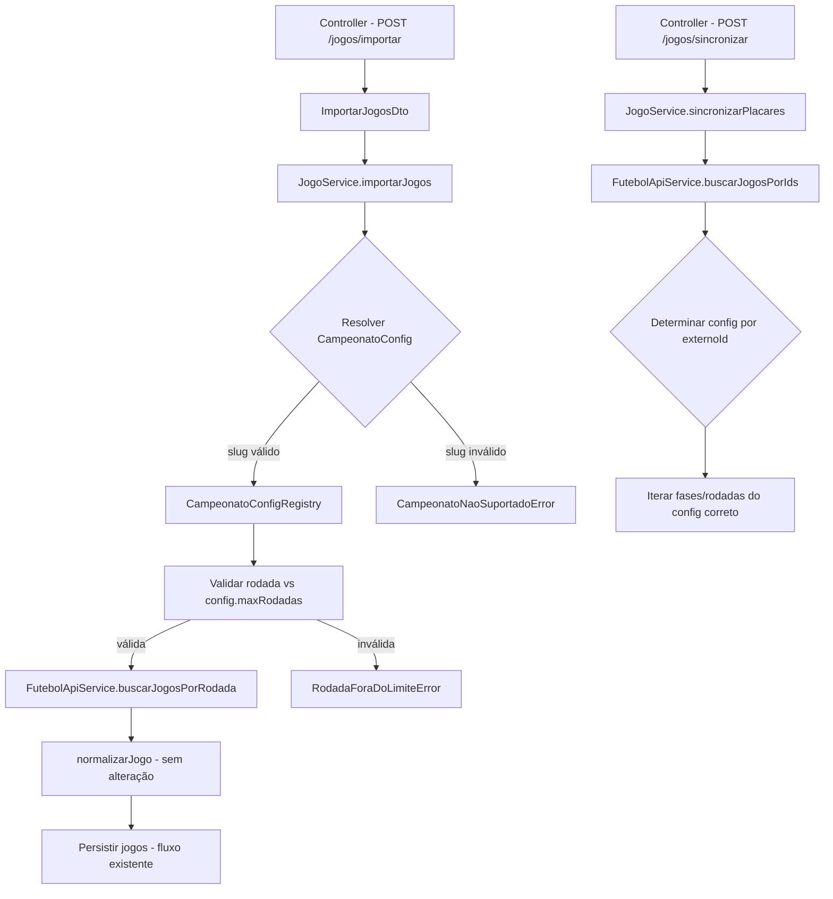

# Documento de Design: Integração Copa do Mundo

## Visão Geral

Esta feature refatora o `FutebolApiService` e o fluxo de importação/sincronização para suportar múltiplos campeonatos. O sistema atual é hardcoded para o Brasileirão (campeonato_id fixo, fase slug com padrão `fase-unica-campeonato-brasileiro-{season}`, rodadas 1-38). A refatoração introduz um **registry de configurações** (`CampeonatoConfig`) que parametriza o acesso à API externa, permitindo importar e sincronizar jogos da Copa do Mundo 2026 sem duplicar código.

A Copa do Mundo 2026 tem 48 seleções em 12 grupos. Os 2 primeiros de cada grupo + 8 melhores terceiros avançam (32 classificados), gerando uma fase eliminatória extra: **32 avos de final** (Round of 32), seguida de oitavas, quartas, semifinais, disputa de 3º lugar e final.

A API do ge.globo.com já suporta a Copa do Mundo com o mesmo formato de dados — os métodos `normalizarJogo` e `mapearStatus` funcionam sem modificação. A mudança é puramente na **construção de URLs** e na **validação de rodadas por fase**.

### Decisões de Design

1. **Registry estático (não banco)** — As configurações de campeonato são constantes conhecidas em tempo de compilação. Não há necessidade de CRUD dinâmico.
2. **Sem alteração no schema Prisma** — A hierarquia Campeonato → Temporada → Fase → Jogo já suporta a Copa do Mundo.
3. **Refatoração da assinatura de `buscarJogosPorRodada`** — Recebe `campeonatoId` e `faseSlug` em vez de construir internamente.
4. **DTO expandido** — `ImportarJogosDto` ganha `campeonatoSlug` e `faseSlug`, com validação de rodada dinâmica no service.
5. **Novos Domain Errors** — Erros específicos para campeonato não suportado e rodada fora do limite.

## Arquitetura



### Fluxo de Dados

1. **Import**: Controller → DTO (com `campeonatoSlug`, `faseSlug`, `rodada`) → Service resolve config → Valida rodada → Chama API com parâmetros corretos → Normaliza → Persiste
2. **Sync**: Service busca jogos pendentes → Agrupa por campeonato (via fase → temporada → campeonato) → Para cada grupo, usa o config correto para buscar na API → Atualiza placares

## Componentes e Interfaces

### CampeonatoConfig (Type)

```typescript
interface FaseConfig {
  slug: string;
  tipo: 'PONTOS_CORRIDOS' | 'MATA_MATA';
  maxRodadas: number;
}

interface CampeonatoConfig {
  campeonatoId: string;       // ID na API do ge.globo.com
  slug: string;               // Identificador interno (ex: 'brasileirao', 'copa-do-mundo-2026')
  nome: string;               // Nome legível
  fases: FaseConfig[];        // Fases disponíveis com seus limites
  buildFaseSlug: (season: number, faseSlug: string) => string;  // Constrói o slug da fase para a URL
}
```

### CampeonatoConfigRegistry

```typescript
// Objeto estático em jogos.constants.ts
const CAMPEONATO_CONFIGS: Record<string, CampeonatoConfig> = {
  'brasileirao': { ... },
  'copa-do-mundo-2026': { ... },
};

function obterCampeonatoConfig(slug: string): CampeonatoConfig;
```

### FutebolApiService (Refatorado)

```typescript
// ANTES (hardcoded):
async buscarJogosPorRodada(season: number, rodada: number): Promise<any[]>

// DEPOIS (parametrizado):
async buscarJogosPorRodada(campeonatoId: string, faseSlug: string, rodada: number): Promise<any[]>

// ANTES (hardcoded 1-38):
async buscarJogosPorIds(ids: number[]): Promise<any[]>

// DEPOIS (usa config):
async buscarJogosPorIds(ids: number[], config: CampeonatoConfig): Promise<any[]>
```

### ImportarJogosDto (Expandido)

```typescript
class ImportarJogosDto {
  campeonatoSlug: 'brasileirao' | 'copa-do-mundo-2026';
  faseSlug: string;
  rodada: number;
  faseId: string;  // UUID da fase no banco onde os jogos serão persistidos
}
```

### Tema Visual (Type)

```typescript
interface TemaConfig {
  corPrimaria: string;   // Hex color (ex: '#009739')
  corSecundaria: string; // Hex color (ex: '#FEDD00')
}
```

Incluído no `CampeonatoConfig`:
```typescript
interface CampeonatoConfig {
  campeonatoId: string;
  slug: string;
  nome: string;
  fases: FaseConfig[];
  tema: TemaConfig;  // Cores para o frontend aplicar layout diferenciado
  buildFaseSlug: (season: number, faseSlug: string) => string;
}
```

### Novos Domain Errors

```typescript
class CampeonatoNaoSuportadoError extends DomainError {
  readonly statusCode = 400;
}

class RodadaForaDoLimiteError extends DomainError {
  readonly statusCode = 400;
}
```

## Modelos de Dados

Nenhuma alteração no schema Prisma é necessária. A hierarquia existente já suporta:

```
Campeonato ("Copa do Mundo FIFA")
  └── Temporada ("Copa do Mundo 2026")
       ├── Fase (tipo: PONTOS_CORRIDOS, nome: "Grupo A") → Jogos com rodada 1-3
       ├── Fase (tipo: PONTOS_CORRIDOS, nome: "Grupo B") → Jogos com rodada 1-3
       ├── ...
       ├── Fase (tipo: MATA_MATA, nome: "32 Avos de Final") → Jogos com rodada 1
       ├── Fase (tipo: MATA_MATA, nome: "Oitavas de Final") → Jogos com rodada 1
       ├── Fase (tipo: MATA_MATA, nome: "Quartas de Final") → Jogos com rodada 1
       ├── Fase (tipo: MATA_MATA, nome: "Semifinais") → Jogos com rodada 1
       ├── Fase (tipo: MATA_MATA, nome: "Disputa 3º Lugar") → Jogos com rodada 1
       └── Fase (tipo: MATA_MATA, nome: "Final") → Jogos com rodada 1
```

### Mapeamento API → Banco

| Campo API (ge.globo.com) | Campo Banco (Jogo) | Observação |
|---|---|---|
| `id` | `externoId` | Convertido para string |
| `data_realizacao` | `dataHora` | BRT → UTC (-03:00) |
| `equipes.mandante.id` | `timeCasaId` | Via resolução de Time |
| `equipes.visitante.id` | `timeForaId` | Via resolução de Time |
| `placar_oficial_mandante` | `golsCasa` | Só quando FINALIZADO |
| `placar_oficial_visitante` | `golsFora` | Só quando FINALIZADO |
| `placar_penaltis_mandante` | `penaltisCasa` | Jogos mata-mata |
| `placar_penaltis_visitante` | `penaltisFora` | Jogos mata-mata |
| `transmissao.broadcast.id` | (status) | ENCERRADA → FINALIZADO |
| `jogo_ja_comecou` | (status) | true → EM_ANDAMENTO |

## Propriedades de Corretude

*Uma propriedade é uma característica ou comportamento que deve ser verdadeiro em todas as execuções válidas do sistema — essencialmente, uma declaração formal sobre o que o sistema deve fazer.*

### Property 1: URL construction uses config parameters

*For any* valid CampeonatoConfig with a `campeonatoId` and any `faseSlug` and `rodada`, the URL constructed by `buscarJogosPorRodada` SHALL contain the `campeonatoId` and `faseSlug` in the correct path segments, producing the pattern `https://api.globoesporte.globo.com/tabela/{campeonatoId}/fase/{faseSlug}/rodada/{rodada}/jogos/`.

**Validates: Requirements 1.2, 6.1, 6.2**

### Property 2: Normalization produces consistent structure regardless of campeonato

*For any* raw game object from the API (with valid `equipes.mandante`, `equipes.visitante`, and status fields), `normalizarJogo` SHALL produce an object containing `externoId`, `dataHora`, `status`, `timeCasaId`, `timeForaId`, `golsCasa`, `golsFora`, `timeCasa`, and `timeFora` — regardless of which campeonato the game belongs to.

**Validates: Requirements 2.2, 6.3, 6.4**

### Property 3: Import always sets fonteResultado to API_EXTERNA

*For any* game successfully imported via the external API (regardless of campeonato, fase, or rodada), the persisted Jogo record SHALL have `fonteResultado` equal to `API_EXTERNA`.

**Validates: Requirements 2.3**

### Property 4: BRT to UTC conversion adds -03:00 offset

*For any* valid `data_realizacao` string from the API (non-null, year >= 2020), the conversion to UTC SHALL produce a datetime that is exactly 3 hours ahead of the original BRT value.

**Validates: Requirements 2.5**

### Property 5: Import auto-creates teams with correct data

*For any* game imported where the team `externoId` does not exist in the database, the import process SHALL create a Time record with the `externoId`, `nome`, `sigla`, and `escudo` values from the API response, and the created team SHALL be retrievable by its `externoId`.

**Validates: Requirements 2.7**

### Property 6: Unrecognized campeonato slug throws CampeonatoNaoSuportadoError

*For any* string that is not a key in the CampeonatoConfig registry, attempting to import games with that slug SHALL throw a `CampeonatoNaoSuportadoError`.

**Validates: Requirements 3.5**

### Property 7: Rodada validation respects configured limits per campeonato/fase

*For any* campeonato/fase combination with a configured `maxRodadas` of N, importing with a rodada value in [1, N] SHALL be accepted, and importing with a rodada value > N or < 1 SHALL be rejected with a domain error.

**Validates: Requirements 3.6, 5.5, 5.6, 8.1, 8.2, 8.3, 8.4**

### Property 8: Sync respects valid status transitions

*For any* game with a current status and a new status from the API, the sync process SHALL only apply the update if the transition is valid according to the `TRANSICOES_VALIDAS` map (AGENDADO→EM_ANDAMENTO, EM_ANDAMENTO→FINALIZADO, etc.). Invalid transitions SHALL be ignored.

**Validates: Requirements 4.2**

### Property 9: Sync updates scores and penalties correctly

*For any* Copa do Mundo game where the API returns a FINALIZADO status with `placar_oficial_mandante`, `placar_oficial_visitante`, and optionally `placar_penaltis_mandante`/`placar_penaltis_visitante`, the sync process SHALL update the local game's `golsCasa`, `golsFora`, `penaltisCasa`, and `penaltisFora` to match the API values.

**Validates: Requirements 4.3, 4.4**

### Property 10: Sync only updates games with fonteResultado API_EXTERNA

*For any* set of games in a fase, the sync process SHALL only fetch and update games where `fonteResultado` equals `API_EXTERNA`. Games with `fonteResultado` = `MANUAL` SHALL remain unchanged after sync.

**Validates: Requirements 4.5**

### Property 11: buscarJogosPorIds iterates correct fases/rodadas per config

*For any* CampeonatoConfig with defined fases and maxRodadas, `buscarJogosPorIds` SHALL iterate over all fase/rodada combinations defined in that config (not hardcoded 1-38), searching until all requested IDs are found or all combinations are exhausted.

**Validates: Requirements 6.5**

## Tratamento de Erros

### Novos Domain Errors

| Error Class | Status Code | Mensagem | Cenário |
|---|---|---|---|
| `CampeonatoNaoSuportadoError` | 400 | "Campeonato '{slug}' não é suportado" | `campeonatoSlug` não existe no registry |
| `RodadaForaDoLimiteError` | 400 | "Rodada {n} excede o limite de {max} para a fase '{fase}'" | Rodada > maxRodadas da fase |
| `FaseSlugInvalidaError` | 400 | "Fase '{slug}' não é válida para o campeonato '{campeonato}'" | faseSlug não existe no config do campeonato |

### Erros Existentes Reutilizados

| Error Class | Cenário na Copa do Mundo |
|---|---|
| `ApiExternaIndisponivelError` | API ge.globo.com indisponível durante import |
| `FaseNaoEncontradaError` | `faseId` do banco não encontrado |

### Comportamento de Sync com API Indisponível

Na sincronização, se a API estiver indisponível:
- Logar warning via `Logger`
- Retornar `{ sincronizados: 0 }` sem lançar exceção
- Não alterar nenhum jogo no banco

## Estratégia de Testes

### Testes Unitários (Vitest)

- **FutebolApiService**: Testar construção de URL com diferentes configs, mock de `fetch`
- **JogoService.importarJogos**: Testar fluxo completo com InMemory repositories
- **Validação de rodada**: Testar limites para cada campeonato/fase
- **Domain Errors**: Testar que erros corretos são lançados para inputs inválidos
- **DTO validation**: Testar `ImportarJogosDto` com class-validator

### Property-Based Tests (Vitest + fast-check)

- Biblioteca: **fast-check** (já compatível com Vitest)
- Mínimo 100 iterações por property test
- Cada test referencia a property do design document via tag comment

**Propriedades a implementar:**
1. URL construction (Property 1)
2. Normalization structure (Property 2)
3. fonteResultado invariant (Property 3)
4. BRT→UTC conversion (Property 4)
5. Team auto-creation round-trip (Property 5)
6. Unrecognized slug rejection (Property 6)
7. Rodada validation per config (Property 7)
8. Status transition enforcement (Property 8)
9. Score/penalty sync correctness (Property 9)
10. fonteResultado filter in sync (Property 10)
11. buscarJogosPorIds iteration strategy (Property 11)

### Testes de Integração

- Import de jogos da Copa do Mundo com mock da API (end-to-end no service)
- Sync de placares com mock da API retornando dados de Copa do Mundo
- Backward compatibility: import do Brasileirão continua funcionando

### Formato de Tag

```typescript
// Feature: copa-do-mundo-integration, Property 7: For any campeonato/fase combination with a configured maxRodadas of N, importing with a rodada value in [1, N] SHALL be accepted, and importing with a rodada value > N or < 1 SHALL be rejected with a domain error.
```
