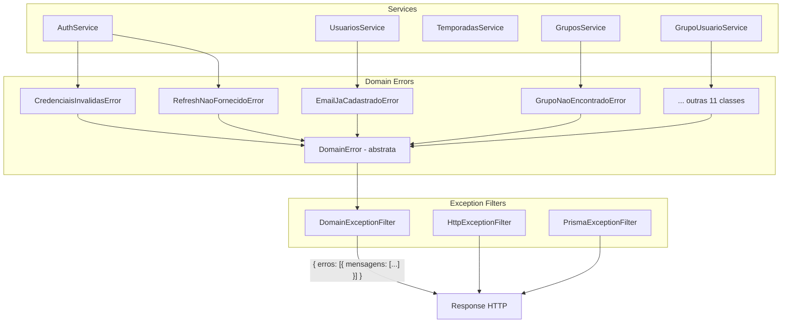

# Design — Domain Errors

## Visão Geral

Este módulo introduz uma hierarquia de erros de domínio que desacopla os services das classes HTTP do NestJS. A arquitetura consiste em:

1. Uma classe abstrata `DomainError` que estende `Error` com `mensagem` e `statusCode`
2. 15 classes concretas de erro, uma por cenário de negócio, organizadas por módulo
3. Um `DomainExceptionFilter` global que converte `DomainError` no formato padrão da API
4. Migração dos 5 services existentes para lançar domain errors em vez de `ErrorFactory`

O `ErrorFactory` permanece intacto como fallback para erros genéricos (guards, pipes, etc.).

## Arquitetura



### Decisões de Design

1. **Classe abstrata vs interface**: `DomainError` é classe abstrata (não interface) porque precisa estender `Error` para funcionar com `throw` e `catch`, e define comportamento concreto no constructor.

2. **Mensagem padrão via constantes existentes**: Cada classe de erro usa a constante `MENSAGENS` do módulo correspondente como valor default. Isso mantém consistência com o padrão existente sem duplicar strings.

3. **Um arquivo por módulo de erros**: As classes de erro ficam agrupadas em `src/common/errors/domain-errors/` com um arquivo por módulo (ex: `auth.errors.ts`), mantendo a organização enxuta.

4. **DomainExceptionFilter separado do HttpExceptionFilter**: O novo filter captura apenas `DomainError`. O `HttpExceptionFilter` existente continua tratando `HttpException` (do `ErrorFactory` e do NestJS). Ambos coexistem via `APP_FILTER`.

5. **Ordem dos filters**: O `DomainExceptionFilter` é registrado antes do `HttpExceptionFilter` no array de providers do `AppModule`. O NestJS executa filters na ordem inversa de registro, então o `DomainExceptionFilter` tem prioridade sobre o catch-all.

## Componentes e Interfaces

### DomainError (classe base abstrata)

```typescript
// src/common/errors/domain-error.ts
export abstract class DomainError extends Error {
  abstract readonly statusCode: number;

  constructor(public readonly mensagem: string) {
    super(mensagem);
    this.name = this.constructor.name;
  }
}
```

### Classes de erro específicas

Cada classe estende `DomainError`, define `statusCode` fixo e recebe mensagem padrão da constante do módulo.

```typescript
// src/common/errors/domain-errors/auth.errors.ts
import { DomainError } from '../domain-error';
import { AUTH } from '../../../modules/auth/auth.constants';

export class CredenciaisInvalidasError extends DomainError {
  readonly statusCode = 401;
  constructor(mensagem = AUTH.MENSAGENS.CREDENCIAIS_INVALIDAS) {
    super(mensagem);
  }
}
```

**Mapeamento completo:**

| Classe | statusCode | Mensagem padrão (constante) |
|--------|-----------|---------------------------|
| `CredenciaisInvalidasError` | 401 | `AUTH.MENSAGENS.CREDENCIAIS_INVALIDAS` |
| `RefreshNaoFornecidoError` | 401 | `AUTH.MENSAGENS.REFRESH_NAO_FORNECIDO` |
| `RefreshInvalidoError` | 401 | `AUTH.MENSAGENS.REFRESH_INVALIDO` |
| `RefreshExpiradoError` | 401 | `AUTH.MENSAGENS.REFRESH_EXPIRADO` |
| `UsuarioNaoEncontradoError` | 404 | `USUARIOS.MENSAGENS.USUARIO_NAO_ENCONTRADO` |
| `EmailJaCadastradoError` | 409 | `USUARIOS.MENSAGENS.EMAIL_JA_CADASTRADO` |
| `CampeonatoNaoEncontradoError` | 404 | `TEMPORADAS.MENSAGENS.CAMPEONATO_NAO_ENCONTRADO` |
| `TemporadaNaoEncontradaError` | 404 | `GRUPOS.MENSAGENS.TEMPORADA_NAO_ENCONTRADA` |
| `GrupoNaoEncontradoError` | 404 | `GRUPOS.MENSAGENS.GRUPO_NAO_ENCONTRADO` |
| `DesativeAntesDeExcluirError` | 400 | `GRUPOS.MENSAGENS.DESATIVE_ANTES_EXCLUIR` |
| `CodigoConviteInvalidoError` | 404 | `GRUPO_USUARIO.MENSAGENS.CODIGO_CONVITE_INVALIDO` |
| `GrupoInativoError` | 400 | `GRUPO_USUARIO.MENSAGENS.GRUPO_INATIVO` |
| `JaEstaNoGrupoError` | 409 | `GRUPO_USUARIO.MENSAGENS.JA_ESTA_NO_GRUPO` |
| `LimiteParticipantesError` | 400 | `GRUPO_USUARIO.MENSAGENS.LIMITE_PARTICIPANTES` |
| `UnicoAdminError` | 400 | `GRUPO_USUARIO.MENSAGENS.UNICO_ADMIN` |

### DomainExceptionFilter

```typescript
// src/common/filters/domain-exception.filter.ts
import { ExceptionFilter, Catch, ArgumentsHost } from '@nestjs/common';
import { Response } from 'express';
import { DomainError } from '../errors/domain-error';

@Catch(DomainError)
export class DomainExceptionFilter implements ExceptionFilter {
  catch(exception: DomainError, host: ArgumentsHost) {
    const ctx = host.switchToHttp();
    const response = ctx.getResponse<Response>();

    response.status(exception.statusCode).json({
      erros: [
        {
          mensagens: [exception.mensagem],
        },
      ],
    });
  }
}
```

### Barrel export

```typescript
// src/common/errors/domain-errors/index.ts
export * from './auth.errors';
export * from './usuarios.errors';
export * from './temporadas.errors';
export * from './grupos.errors';
export * from './grupo-usuario.errors';
```

### Registro no AppModule

```typescript
// Adição ao providers do AppModule
{
  provide: APP_FILTER,
  useClass: DomainExceptionFilter,
},
{
  provide: APP_FILTER,
  useClass: HttpExceptionFilter,
},
{
  provide: APP_FILTER,
  useClass: PrismaExceptionFilter,
},
```

### Exemplo de migração (AuthService)

```typescript
// Antes
throw ErrorFactory.unauthorized(AUTH.MENSAGENS.CREDENCIAIS_INVALIDAS);

// Depois
throw new CredenciaisInvalidasError();
```

## Modelo de Dados

Este módulo não altera o schema do banco. As classes de erro são puramente em memória.

Estrutura de arquivos criados:

```
src/common/errors/
├── domain-error.ts                  # Classe base abstrata
├── domain-errors/
│   ├── index.ts                     # Barrel export
│   ├── auth.errors.ts               # 4 classes (Auth)
│   ├── usuarios.errors.ts           # 2 classes (Usuarios)
│   ├── temporadas.errors.ts         # 1 classe (Temporadas)
│   ├── grupos.errors.ts             # 3 classes (Grupos)
│   └── grupo-usuario.errors.ts      # 5 classes (GrupoUsuario)
├── error.factory.ts                 # Mantido sem alterações
src/common/filters/
├── domain-exception.filter.ts       # Novo filter
├── http-exception.filter.ts         # Mantido sem alterações
├── prisma-exception.filter.ts       # Mantido sem alterações
```

## Propriedades de Corretude

*Uma propriedade é uma característica ou comportamento que deve ser verdadeiro em todas as execuções válidas de um sistema — essencialmente, uma declaração formal sobre o que o sistema deve fazer. Propriedades servem como ponte entre especificações legíveis por humanos e garantias de corretude verificáveis por máquina.*

### Propriedade 1: Estrutura da classe base DomainError

*Para qualquer* subclasse concreta de `DomainError` instanciada com uma mensagem aleatória, a instância deve: (a) ser `instanceof Error`, (b) ter `mensagem` igual à string fornecida, (c) ter `statusCode` como number, e (d) ter `name` igual ao nome do constructor da classe concreta.

**Valida: Requisitos 1.1, 1.2, 1.3**

### Propriedade 2: Classes de erro específicas com defaults corretos

*Para todas* as 15 classes de erro específicas, instanciar sem argumentos deve produzir uma instância que: (a) é `instanceof DomainError`, (b) tem `statusCode` igual ao código HTTP esperado (400, 401, 404 ou 409), e (c) tem `mensagem` igual à constante `MENSAGENS` correspondente do módulo.

**Valida: Requisitos 2.1, 2.2, 2.3, 2.4, 2.5, 2.6, 2.7**

### Propriedade 3: DomainExceptionFilter produz formato padrão

*Para qualquer* `DomainError` com `statusCode` e `mensagem` aleatórios, quando o `DomainExceptionFilter` captura a exceção, a resposta HTTP deve ter: (a) status code igual ao `statusCode` do erro, e (b) body no formato `{ erros: [{ mensagens: [mensagem] }] }`.

**Valida: Requisitos 3.2**

## Tratamento de Erros

### Fluxo de exceções

1. Service lança `new XxxError()` (subclasse de `DomainError`)
2. NestJS propaga a exceção para os exception filters registrados
3. `DomainExceptionFilter` (com `@Catch(DomainError)`) captura a exceção
4. O filter extrai `statusCode` e `mensagem` e retorna a resposta no formato padrão
5. Se a exceção não é `DomainError`, o `HttpExceptionFilter` ou `PrismaExceptionFilter` trata

### Coexistência de filters

| Filter | Captura | Prioridade |
|--------|---------|-----------|
| `DomainExceptionFilter` | `DomainError` e subclasses | Alta (registrado primeiro) |
| `PrismaExceptionFilter` | `PrismaClientKnownRequestError` | Média |
| `HttpExceptionFilter` | `@Catch()` — catch-all | Baixa (fallback) |

### Erros não cobertos por domain errors

Guards (`JwtAuthGuard`, `GroupRoleGuard`, `SelfOrAdminGuard`) continuam usando `ErrorFactory` para lançar `HttpException`. Esses erros são capturados pelo `HttpExceptionFilter` existente.

## Estratégia de Testes

### Biblioteca de Property-Based Testing

Usar `fast-check` com Vitest. Configurar mínimo de 100 iterações por teste.

### Testes de propriedade (property-based)

Cada propriedade do design deve ser implementada como um único teste property-based:

- **Feature: domain-errors, Property 1: Estrutura da classe base DomainError** — Gerar mensagens aleatórias, instanciar subclasses concretas, verificar instanceof, mensagem, statusCode e name.
- **Feature: domain-errors, Property 2: Classes de erro específicas com defaults corretos** — Iterar sobre array das 15 classes com seus statusCodes e mensagens esperados, instanciar sem argumentos, verificar os 3 critérios.
- **Feature: domain-errors, Property 3: DomainExceptionFilter produz formato padrão** — Gerar statusCodes (entre 400-499) e mensagens aleatórias, criar DomainError concreto, executar o filter com mock de ArgumentsHost, verificar status e body.

### Testes unitários (exemplos e edge cases)

Testes unitários complementam as properties para cenários específicos:

- **DomainExceptionFilter**: Verificar que exceções não-DomainError não são capturadas (coberto pelo `@Catch(DomainError)`)
- **Registro no AppModule**: Verificar que `DomainExceptionFilter` está registrado como `APP_FILTER`
- **Migração dos services**: Para cada service migrado, atualizar os testes existentes para usar `expect(...).toThrow(ClasseDeErroEspecifica)` em vez de `toThrow(HttpException)`:
  - `AuthService`: `CredenciaisInvalidasError`, `RefreshNaoFornecidoError`, `RefreshInvalidoError`, `RefreshExpiradoError`
  - `UsuariosService`: `EmailJaCadastradoError`, `UsuarioNaoEncontradoError`
  - `TemporadasService`: `CampeonatoNaoEncontradoError`
  - `GruposService`: `TemporadaNaoEncontradaError`, `GrupoNaoEncontradoError`, `DesativeAntesDeExcluirError`
  - `GrupoUsuarioService`: `CodigoConviteInvalidoError`, `GrupoInativoError`, `JaEstaNoGrupoError`, `LimiteParticipantesError`, `UnicoAdminError`

### Configuração dos testes de propriedade

- Biblioteca: `fast-check`
- Mínimo de iterações: 100
- Cada teste deve ter comentário referenciando a propriedade do design:
  ```typescript
  // Feature: domain-errors, Property 1: Estrutura da classe base DomainError
  ```
- Cada propriedade de corretude deve ser implementada por um ÚNICO teste property-based
