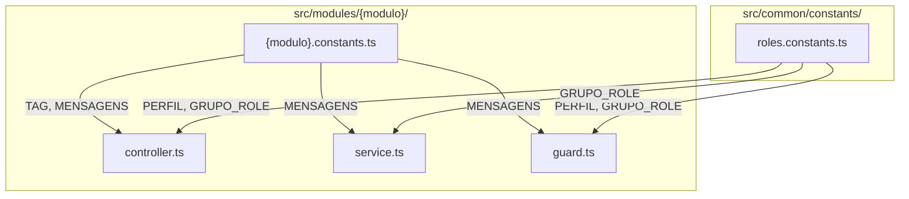

# Design — Extrair Constantes por Módulo

## Visão Geral

Esta feature refatora o projeto para centralizar todas as strings hardcoded (tags Swagger, mensagens de erro, mensagens de resposta e valores de roles) em arquivos de constantes. Cada módulo ganha um `{modulo}.constants.ts` com um objeto `as const`, e um arquivo global `roles.constants.ts` centraliza os valores de roles usados em guards, services e decorators.

A refatoração é puramente estrutural — nenhum valor de string muda, nenhum comportamento é alterado.

## Arquitetura



Fluxo simples: cada arquivo de constantes por módulo exporta um objeto `as const` com `TAG` e `MENSAGENS`. O arquivo global exporta `PERFIL` e `GRUPO_ROLE`. Controllers, services e guards importam desses arquivos em vez de usar strings literais.

## Componentes e Interfaces

### 1. Arquivo global de roles — `src/common/constants/roles.constants.ts`

```typescript
export const PERFIL = {
  SUPER_ADMIN: 'SUPER_ADMIN',
  USER: 'USER',
} as const;

export const GRUPO_ROLE = {
  ADMIN: 'ADMIN',
  MEMBER: 'MEMBER',
} as const;
```

### 2. Arquivo de constantes por módulo — `src/modules/{modulo}/{modulo}.constants.ts`

Cada módulo segue o mesmo padrão. Exemplo para `auth`:

```typescript
export const AUTH = {
  TAG: 'Autenticação',
  MENSAGENS: {
    CREDENCIAIS_INVALIDAS: 'Credenciais inválidas',
    REFRESH_NAO_FORNECIDO: 'Refresh token não fornecido',
    REFRESH_INVALIDO: 'Refresh token inválido',
    REFRESH_EXPIRADO: 'Refresh token expirado',
    USUARIO_NAO_ENCONTRADO: 'Usuário não encontrado',
    LOGOUT_SUCESSO: 'Logout realizado com sucesso',
  },
} as const;
```

Módulos que serão criados:
- `auth.constants.ts` — TAG + mensagens do auth.service e guards
- `usuarios.constants.ts` — TAG + mensagens do usuarios.service
- `campeonatos.constants.ts` — TAG (sem mensagens de erro no service atual)
- `temporadas.constants.ts` — TAG + mensagens do temporadas.service
- `grupos.constants.ts` — TAG + mensagens do grupos.service
- `grupo-usuario.constants.ts` — TAG + mensagens do grupo-usuario.service

### 3. Mapeamento completo de strings por módulo

**auth** (controller + service + guards):
- TAG: `'Autenticação'`
- ErrorFactory: `'Credenciais inválidas'`, `'Refresh token não fornecido'`, `'Refresh token inválido'`, `'Refresh token expirado'`, `'Usuário não encontrado'`
- Mensagem de resposta: `'Logout realizado com sucesso'`
- Guards (group-role): `'Grupo não informado'`, `'Usuário não pertence a este grupo'`, `'Sem permissão neste grupo'`
- Guards (self-or-admin): `'Usuário não autenticado'`, `'Sem permissão para acessar este recurso'`
- Roles no self-or-admin: `'SUPER_ADMIN'` → `PERFIL.SUPER_ADMIN`

**usuarios**:
- TAG: `'Usuarios'`
- ErrorFactory: `'Email já cadastrado'`, `'Usuário não encontrado'`
- Mensagens de resposta: `'Usuário já está inativo'`, `'Usuário desativado com sucesso'`

**campeonatos**:
- TAG: `'Campeonatos'`
- Sem mensagens de erro (service não usa ErrorFactory)

**temporadas**:
- TAG: `'Temporadas'`
- ErrorFactory: `'Campeonato não encontrado'`

**grupos**:
- TAG: `'Grupos'`
- ErrorFactory: `'Temporada não encontrada'`, `'Grupo não encontrado'`, `'Desative o grupo antes de excluí-lo'`
- Mensagem de resposta: `'Grupo excluído com sucesso.'`
- Role no service: `'ADMIN'` → `GRUPO_ROLE.ADMIN`

**grupo-usuario**:
- TAG: `'Grupo - Membros'`
- ErrorFactory: `'Código de convite inválido'`, `'Grupo está inativo'`, `'Grupo não encontrado'`, `'Usuário não encontrado'`, `'Você já está neste grupo'`, `'Grupo atingiu o limite de participantes'`, `'Você não está neste grupo'`, `'Usuário não está neste grupo'`, `'Não é possível sair sendo o único administrador do grupo'`
- Mensagens de resposta: `'Você saiu do grupo'`, `'Usuário removido do grupo'`
- Roles no service: `'ADMIN'`, `'MEMBER'` → `GRUPO_ROLE.ADMIN`, `GRUPO_ROLE.MEMBER` (já usa constantes locais `ROLE_ADMIN`/`ROLE_MEMBER`, migrar para global)

**Controllers com `@GroupRoles('ADMIN')` ou `@GroupRoles('ADMIN', 'MEMBER')`:**
- `grupos.controller.ts` — 3 ocorrências de `'ADMIN'`
- `grupo-usuario.controller.ts` — 2 ocorrências de `'ADMIN'`, 1 de `'ADMIN', 'MEMBER'`

Todos passam a usar `GRUPO_ROLE.ADMIN` e `GRUPO_ROLE.MEMBER`.

## Modelos de Dados

Não há alteração em modelos de dados. Esta feature é puramente de refatoração de código — nenhuma tabela, coluna ou schema Prisma é afetado.


## Propriedades de Corretude

*Uma propriedade é uma característica ou comportamento que deve ser verdadeiro em todas as execuções válidas de um sistema — essencialmente, uma declaração formal sobre o que o sistema deve fazer. Propriedades servem como ponte entre especificações legíveis por humanos e garantias de corretude verificáveis por máquina.*

### Propriedade 1: Ausência de strings hardcoded em chamadas ErrorFactory, @ApiTags e retornos de mensagem

*Para qualquer* arquivo de controller, service ou guard nos 6 módulos, não deve existir nenhuma string literal passada diretamente como argumento para `ErrorFactory.*()`, `@ApiTags()`, ou em objetos de retorno `{ mensagem: '...' }`. Todos esses valores devem ser referências a constantes importadas dos arquivos `*.constants.ts`.

**Valida: Requisitos 1.3, 3.1, 4.1, 4.2, 4.4**

### Propriedade 2: Ausência de strings literais de role em guards, services e controllers

*Para qualquer* arquivo de guard, service ou controller que referencia valores de role (`'ADMIN'`, `'MEMBER'`, `'SUPER_ADMIN'`, `'USER'`), esses valores devem ser referências às constantes globais `GRUPO_ROLE` ou `PERFIL` importadas de `roles.constants.ts`, e não strings literais.

**Valida: Requisitos 2.2, 3.2, 4.3**

### Propriedade 3: Preservação dos valores originais nas constantes

*Para qualquer* constante definida nos arquivos `*.constants.ts`, o valor da string deve ser exatamente igual ao valor que existia hardcoded antes da refatoração. A refatoração não deve alterar nenhum valor — apenas mover strings para constantes nomeadas.

**Valida: Requisito 5.1**

## Tratamento de Erros

Não há alteração no tratamento de erros. O `ErrorFactory` continua sendo o ponto único de criação de exceções. A única mudança é que as strings passadas como argumento agora vêm de constantes em vez de literais.

Cenários de erro permanecem idênticos:
- `ErrorFactory.notFound(MENSAGENS.X)` em vez de `ErrorFactory.notFound('...')`
- `ErrorFactory.badRequest(MENSAGENS.X)` em vez de `ErrorFactory.badRequest('...')`
- Mesmos status HTTP, mesma estrutura de resposta `{ erros: [{ mensagens: [...] }] }`

## Estratégia de Testes

### Testes unitários

- Verificar que cada arquivo de constantes exporta o objeto com `TAG` e `MENSAGENS` (exemplos concretos para os 6 módulos)
- Verificar que `roles.constants.ts` exporta `PERFIL` e `GRUPO_ROLE` com os valores corretos
- Verificar que os testes existentes continuam passando (suite de regressão)

### Testes baseados em propriedades

- Biblioteca: `fast-check` (já compatível com Vitest)
- Mínimo 100 iterações por teste
- Cada teste deve referenciar a propriedade do design com tag: **Feature: extrair-constantes, Property {N}: {texto}**

**Propriedade 1** — Análise estática via regex/AST nos arquivos fonte: gerar combinações de módulos e tipos de arquivo (controller/service/guard), verificar ausência de strings literais em chamadas ErrorFactory e @ApiTags.

**Propriedade 2** — Análise estática: para cada arquivo de guard/service/controller, verificar que strings de role não aparecem como literais.

**Propriedade 3** — Snapshot dos valores: comparar cada valor de constante com o valor esperado (mapeamento completo definido no design).

### Abordagem prática

Como esta é uma refatoração puramente estrutural, a principal validação é:
1. Os testes existentes passam sem alteração (regressão)
2. Os valores das constantes correspondem exatamente aos valores originais
3. Nenhuma string hardcoded permanece nos arquivos refatorados
