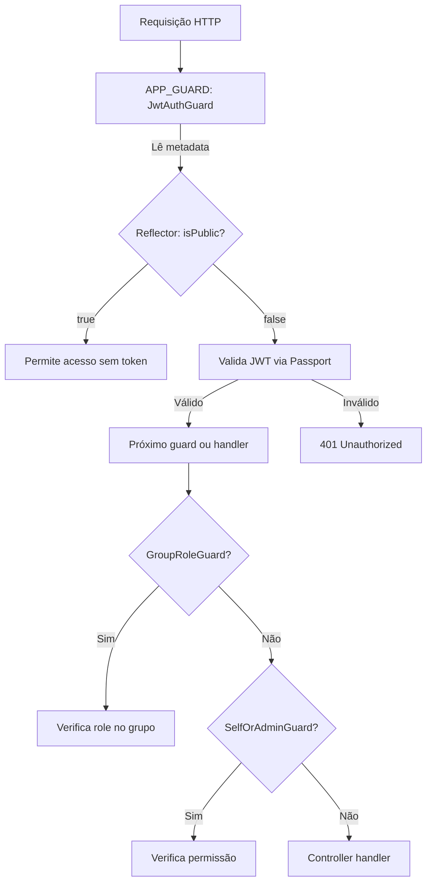

# Design — Guards Globais (APP_GUARD)

## Visão Geral

Este design transforma a autenticação JWT de opt-in (cada controller aplica `@UseGuards(JwtAuthGuard)` manualmente) para opt-out (todas as rotas são protegidas por padrão, rotas públicas são marcadas com `@Public()`).

A mudança envolve:
1. Criar um decorator `@Public()` que define metadata `isPublic`
2. Atualizar `JwtAuthGuard` para consultar essa metadata via `Reflector`
3. Registrar `JwtAuthGuard` como `APP_GUARD` no `AppModule`
4. Marcar rotas públicas e remover `@UseGuards(JwtAuthGuard)` manuais

O resultado é um sistema "seguro por padrão" — esquecer um decorator não expõe a rota.

## Arquitetura



Ordem de execução dos guards:
1. `JwtAuthGuard` (global via APP_GUARD) — autentica
2. `GroupRoleGuard` ou `SelfOrAdminGuard` (por rota via `@UseGuards`) — autoriza

Os guards de autorização (`GroupRoleGuard`, `SelfOrAdminGuard`) continuam sendo aplicados por rota. Eles dependem de `request.user` já estar populado pelo `JwtAuthGuard`.

## Componentes e Interfaces

### 1. `@Public()` Decorator

**Arquivo:** `src/common/decorators/public.decorator.ts`

```typescript
import { SetMetadata } from '@nestjs/common';

export const IS_PUBLIC_KEY = 'isPublic';
export const Public = () => SetMetadata(IS_PUBLIC_KEY, true);
```

- Exporta a constante `IS_PUBLIC_KEY` para uso no guard
- Usa `SetMetadata` do NestJS (mesmo padrão do `@GroupRoles()` existente)

### 2. `JwtAuthGuard` (atualizado)

**Arquivo:** `src/modules/auth/jwt-auth.guard.ts`

```typescript
import { Injectable, ExecutionContext } from '@nestjs/common';
import { AuthGuard } from '@nestjs/passport';
import { Reflector } from '@nestjs/core';
import { IS_PUBLIC_KEY } from '../../common/decorators/public.decorator';

@Injectable()
export class JwtAuthGuard extends AuthGuard('jwt') {
  constructor(private readonly reflector: Reflector) {
    super();
  }

  canActivate(context: ExecutionContext) {
    const isPublic = this.reflector.getAllAndOverride<boolean>(IS_PUBLIC_KEY, [
      context.getHandler(),
      context.getClass(),
    ]);

    if (isPublic) {
      return true;
    }

    return super.canActivate(context);
  }
}
```

- Injeta `Reflector` via constructor
- Usa `getAllAndOverride` para checar metadata no handler e na classe (mesmo padrão do `GroupRoleGuard`)
- Se `isPublic` é `true`, retorna `true` sem validar token
- Caso contrário, delega para `AuthGuard('jwt')` do Passport

### 3. `AppModule` (atualizado)

**Arquivo:** `src/app.module.ts`

```typescript
import { APP_GUARD } from '@nestjs/core';
import { JwtAuthGuard } from './modules/auth/jwt-auth.guard';

// No array de providers:
providers: [
  {
    provide: APP_GUARD,
    useClass: JwtAuthGuard,
  },
],
```

- Registra `JwtAuthGuard` como guard global
- Imports de módulos permanecem inalterados

### 4. Rotas públicas marcadas com `@Public()`

| Controller | Rota | Ação |
|---|---|---|
| `AuthController` | `POST /auth/login` | Adicionar `@Public()` |
| `AuthController` | `POST /auth/refresh` | Adicionar `@Public()` |
| `AuthController` | `POST /auth/logout` | **Não** marcar (protegida) |
| `UsuariosController` | `POST /usuarios` | Adicionar `@Public()` |
| `AppController` | `GET /health` | Adicionar `@Public()` |

### 5. Remoções de `@UseGuards(JwtAuthGuard)`

| Controller | Tipo | Detalhe |
|---|---|---|
| `CampeonatosController` | Classe | Remover `@UseGuards(JwtAuthGuard)` |
| `TemporadasController` | Classe | Remover `@UseGuards(JwtAuthGuard)` |
| `GruposController` | Classe | Remover `@UseGuards(JwtAuthGuard)` |
| `GrupoUsuarioController` | Classe | Remover `@UseGuards(JwtAuthGuard)` |
| `UsuariosController` | Método | Remover `JwtAuthGuard` de `@UseGuards(JwtAuthGuard)` em `GET /me` e remover `JwtAuthGuard` de `@UseGuards(JwtAuthGuard, SelfOrAdminGuard)` em `GET /:id`, `PATCH /:id`, `DELETE /:id` (manter `SelfOrAdminGuard`) |

### 6. Impacto nos guards de autorização

`GroupRoleGuard` e `SelfOrAdminGuard` continuam funcionando sem alteração:
- O `JwtAuthGuard` global executa primeiro e popula `request.user`
- Os guards de autorização são aplicados depois via `@UseGuards()` por rota
- A ordem de execução do NestJS garante: guards globais → guards de classe → guards de método

## Modelos de Dados

Nenhuma alteração em modelos de dados. Esta feature é puramente de infraestrutura de autenticação/autorização.

A única "estrutura de dados" envolvida é a metadata `isPublic` (boolean) armazenada via `Reflect.defineMetadata` pelo NestJS internamente.


## Propriedades de Corretude

*Uma propriedade é uma característica ou comportamento que deve ser verdadeiro em todas as execuções válidas de um sistema — essencialmente, uma declaração formal sobre o que o sistema deve fazer. Propriedades servem como ponte entre especificações legíveis por humanos e garantias de corretude verificáveis por máquina.*

### Propriedade 1: @Public() define metadata isPublic

*Para qualquer* método de controller decorado com `@Public()`, o `Reflector` deve retornar `true` para a chave `IS_PUBLIC_KEY` nesse handler. Para qualquer método sem `@Public()`, deve retornar `false` ou `undefined`.

**Valida: Requisitos 1.1, 1.2**

### Propriedade 2: Rotas públicas permitem acesso sem token

*Para qualquer* `ExecutionContext` onde a metadata `isPublic` é `true`, o `JwtAuthGuard.canActivate()` deve retornar `true` sem invocar a validação JWT do Passport.

**Valida: Requisitos 2.1, 4.5**

### Propriedade 3: Rotas não-públicas delegam para validação JWT

*Para qualquer* `ExecutionContext` onde a metadata `isPublic` é `false` ou `undefined`, o `JwtAuthGuard.canActivate()` deve delegar para `super.canActivate()` (Passport), que valida o token JWT.

**Valida: Requisitos 2.2, 3.2**

## Tratamento de Erros

| Cenário | Código HTTP | Comportamento |
|---|---|---|
| Token ausente em rota protegida | 401 | Passport retorna `Unauthorized` (comportamento existente, sem alteração) |
| Token inválido/expirado em rota protegida | 401 | Passport retorna `Unauthorized` (comportamento existente, sem alteração) |
| Token ausente em rota pública | — | Guard retorna `true`, requisição prossegue normalmente |
| Token inválido em rota pública | — | Guard retorna `true`, token nem é verificado |

Nenhum novo formato de erro é introduzido. O `JwtAuthGuard` continua delegando erros de autenticação para o Passport, que já retorna 401 no formato padrão.

## Estratégia de Testes

### Biblioteca de Property-Based Testing

Usar `fast-check` com Vitest (já configurado no projeto).

### Testes de Propriedade (PBT)

Cada propriedade de corretude será implementada como um único teste com `fast-check`, mínimo 100 iterações:

1. **Propriedade 1** — Gerar handlers aleatórios (com e sem `@Public()`), verificar que `Reflector` retorna o valor correto de `isPublic`
   - Tag: `Feature: guards-globais, Property 1: @Public() define metadata isPublic`

2. **Propriedade 2** — Gerar `ExecutionContext` mocks com `isPublic=true`, verificar que `canActivate` retorna `true` sem chamar `super.canActivate`
   - Tag: `Feature: guards-globais, Property 2: Rotas públicas permitem acesso sem token`

3. **Propriedade 3** — Gerar `ExecutionContext` mocks com `isPublic=false/undefined`, verificar que `canActivate` delega para `super.canActivate`
   - Tag: `Feature: guards-globais, Property 3: Rotas não-públicas delegam para validação JWT`

### Testes Unitários

Testes específicos para exemplos e edge cases:

- **Rotas públicas corretas**: Verificar que `login`, `refresh`, `criarUsuario` e `health` têm metadata `isPublic=true`
- **Logout protegido**: Verificar que `logout` não tem metadata `isPublic`
- **APP_GUARD registrado**: Verificar que `AppModule` tem o provider `APP_GUARD` com `JwtAuthGuard`
- **Guards de autorização mantidos**: Verificar que rotas com `GroupRoleGuard` e `SelfOrAdminGuard` continuam com esses guards
- **401 em rota protegida sem token**: Teste de integração verificando que requisição sem token em rota protegida retorna 401

### Configuração

- Cada teste PBT deve rodar com mínimo 100 iterações (`fc.assert(property, { numRuns: 100 })`)
- Cada teste PBT deve ter comentário referenciando a propriedade do design
- Formato do tag: `Feature: guards-globais, Property {número}: {texto}`
