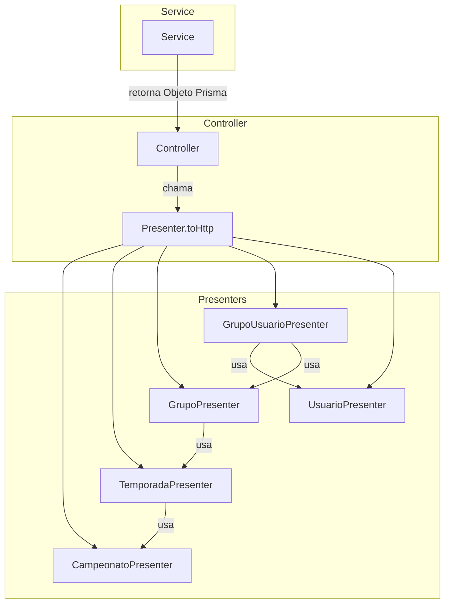

# Design — Mappers/Presenters

## Visão Geral

Este design introduz o padrão Presenter no projeto para transformar objetos Prisma em respostas HTTP seguras e consistentes. Cada Presenter é uma classe com um método estático `toHttp()` que recebe um objeto Prisma e retorna apenas os campos permitidos via seleção positiva (allowlist).

Os Presenters ficam em `src/common/presenters/` como módulo compartilhado, já que são usados por múltiplos controllers. A transformação acontece exclusivamente nos controllers — os services continuam retornando objetos Prisma puros.

### Decisões de Design

1. **Localização centralizada**: `src/common/presenters/` em vez de dentro de cada módulo, pois Presenters referenciam uns aos outros (ex: `GrupoPresenter` usa `TemporadaPresenter` que usa `CampeonatoPresenter`).
2. **Método estático `toHttp()`**: Sem instanciação, sem estado. Simples e direto.
3. **Seleção positiva (allowlist)**: Cada `toHttp()` lista explicitamente os campos retornados. Campos novos no Prisma não vazam automaticamente.
4. **Relações opcionais**: Quando o objeto Prisma inclui relações (ex: `temporada.campeonato`), o Presenter as transforma recursivamente. Quando não inclui, o campo é omitido.
5. **Tipagem com Prisma generated types**: Usar tipos gerados pelo Prisma (`Prisma.CampeonatoGetPayload`) para tipar os parâmetros de `toHttp()`, garantindo type-safety.

## Arquitetura



### Fluxo de Dados

```
Request → Controller → Service → Prisma → Objeto Prisma
                                              ↓
Response ← Controller ← Presenter.toHttp() ←─┘
```

## Componentes e Interfaces

### CampeonatoPresenter

```typescript
// src/common/presenters/campeonato.presenter.ts
import { Campeonato } from '@prisma/client';

export class CampeonatoPresenter {
  static toHttp(campeonato: Campeonato) {
    return {
      id: campeonato.id,
      nome: campeonato.nome,
      dataCriacao: campeonato.dataCriacao,
      atualizadoEm: campeonato.atualizadoEm,
    };
  }
}
```

### TemporadaPresenter

```typescript
// src/common/presenters/temporada.presenter.ts
import { Campeonato, Temporada } from '@prisma/client';
import { CampeonatoPresenter } from './campeonato.presenter';

type TemporadaComRelacoes = Temporada & {
  campeonato?: Campeonato;
};

export class TemporadaPresenter {
  static toHttp(temporada: TemporadaComRelacoes) {
    return {
      id: temporada.id,
      ano: temporada.ano,
      campeonatoId: temporada.campeonatoId,
      dataCriacao: temporada.dataCriacao,
      ...(temporada.campeonato && {
        campeonato: CampeonatoPresenter.toHttp(temporada.campeonato),
      }),
    };
  }
}
```

### GrupoPresenter

```typescript
// src/common/presenters/grupo.presenter.ts
import { Grupo, Temporada, Campeonato } from '@prisma/client';
import { TemporadaPresenter } from './temporada.presenter';

type GrupoComRelacoes = Grupo & {
  temporada?: Temporada & { campeonato?: Campeonato };
};

export class GrupoPresenter {
  static toHttp(grupo: GrupoComRelacoes) {
    return {
      id: grupo.id,
      nome: grupo.nome,
      temporadaId: grupo.temporadaId,
      privado: grupo.privado,
      codigoConvite: grupo.codigoConvite,
      permitirPalpiteAutomatico: grupo.permitirPalpiteAutomatico,
      maxParticipantes: grupo.maxParticipantes,
      ativo: grupo.ativo,
      dataCriacao: grupo.dataCriacao,
      createdById: grupo.createdById,
      ...(grupo.temporada && {
        temporada: TemporadaPresenter.toHttp(grupo.temporada),
      }),
    };
  }
}
```

### GrupoUsuarioPresenter

```typescript
// src/common/presenters/grupo-usuario.presenter.ts
import { GrupoUsuario, Usuario, Grupo, Temporada, Campeonato } from '@prisma/client';
import { UsuarioPresenter } from './usuario.presenter';
import { GrupoPresenter } from './grupo.presenter';

type GrupoUsuarioComRelacoes = GrupoUsuario & {
  usuario?: Usuario;
  grupo?: Grupo & { temporada?: Temporada & { campeonato?: Campeonato } };
};

export class GrupoUsuarioPresenter {
  static toHttp(grupoUsuario: GrupoUsuarioComRelacoes) {
    return {
      id: grupoUsuario.id,
      usuarioId: grupoUsuario.usuarioId,
      grupoId: grupoUsuario.grupoId,
      role: grupoUsuario.role,
      ...(grupoUsuario.usuario && {
        usuario: UsuarioPresenter.toHttp(grupoUsuario.usuario),
      }),
      ...(grupoUsuario.grupo && {
        grupo: GrupoPresenter.toHttp(grupoUsuario.grupo),
      }),
    };
  }
}
```

### UsuarioPresenter

```typescript
// src/common/presenters/usuario.presenter.ts
import { Usuario } from '@prisma/client';

export class UsuarioPresenter {
  static toHttp(usuario: Usuario) {
    return {
      id: usuario.id,
      nome: usuario.nome,
      email: usuario.email,
      perfil: usuario.perfil,
      ativo: usuario.ativo,
      dataCriacao: usuario.dataCriacao,
      atualizadoEm: usuario.atualizadoEm,
    };
  }
}
```

### Barrel Export

```typescript
// src/common/presenters/index.ts
export { CampeonatoPresenter } from './campeonato.presenter';
export { TemporadaPresenter } from './temporada.presenter';
export { GrupoPresenter } from './grupo.presenter';
export { GrupoUsuarioPresenter } from './grupo-usuario.presenter';
export { UsuarioPresenter } from './usuario.presenter';
```

## Modelos de Dados

Os Presenters não introduzem novos modelos no banco. Eles transformam os modelos Prisma existentes:

| Modelo Prisma | Campos no Presenter | Campos Omitidos |
|---|---|---|
| Campeonato | id, nome, dataCriacao, atualizadoEm | temporadas (relação) |
| Temporada | id, ano, campeonatoId, dataCriacao, campeonato? | grupos (relação) |
| Grupo | id, nome, temporadaId, privado, codigoConvite, permitirPalpiteAutomatico, maxParticipantes, ativo, dataCriacao, createdById, temporada? | createdBy (relação), usuarios (relação) |
| GrupoUsuario | id, usuarioId, grupoId, role, usuario?, grupo? | — |
| Usuario | id, nome, email, perfil, ativo, dataCriacao, atualizadoEm | senha, gruposCriados, grupos, refreshTokens |

### Tipos de Retorno

Cada `toHttp()` retorna um objeto literal inferido pelo TypeScript. Não são criadas interfaces separadas — o tipo é inferido do `return`, mantendo o código DRY e evitando duplicação.


## Propriedades de Corretude

*Uma propriedade é uma característica ou comportamento que deve ser verdadeiro em todas as execuções válidas de um sistema — essencialmente, uma declaração formal sobre o que o sistema deve fazer. Propriedades servem como ponte entre especificações legíveis por humanos e garantias de corretude verificáveis por máquina.*

### Propriedade 1: Allowlist — toHttp() retorna apenas campos permitidos

*Para qualquer* Presenter e *para qualquer* objeto Prisma válido da entidade correspondente (incluindo objetos com campos extras, relações, ou dados inesperados), `toHttp()` deve retornar um objeto cujas chaves são exatamente o conjunto permitido para aquela entidade:
- CampeonatoPresenter: `{id, nome, dataCriacao, atualizadoEm}`
- TemporadaPresenter: `{id, ano, campeonatoId, dataCriacao}` (+ `campeonato` se relação presente)
- GrupoPresenter: `{id, nome, temporadaId, privado, codigoConvite, permitirPalpiteAutomatico, maxParticipantes, ativo, dataCriacao, createdById}` (+ `temporada` se relação presente)
- GrupoUsuarioPresenter: `{id, usuarioId, grupoId, role}` (+ `usuario` se relação presente, + `grupo` se relação presente)
- UsuarioPresenter: `{id, nome, email, perfil, ativo, dataCriacao, atualizadoEm}`

Nenhum campo fora desta lista (como `senha`, `refreshTokens`, `gruposCriados`, `grupos`, `temporadas`) deve aparecer no retorno.

**Validates: Requirements 1.1, 2.1, 3.1, 4.1, 5.1, 5.2, 6.1, 6.2, 7.1, 7.2, 7.3, 7.4**

### Propriedade 2: Composição de relações — relações presentes são transformadas recursivamente

*Para qualquer* Presenter que suporte relações opcionais e *para qualquer* objeto Prisma que inclua essa relação, o campo da relação no retorno de `toHttp()` deve ser igual ao resultado de chamar `toHttp()` do Presenter filho correspondente:
- TemporadaPresenter com campeonato → `CampeonatoPresenter.toHttp(campeonato)`
- GrupoPresenter com temporada → `TemporadaPresenter.toHttp(temporada)`
- GrupoUsuarioPresenter com usuario → `UsuarioPresenter.toHttp(usuario)`
- GrupoUsuarioPresenter com grupo → `GrupoPresenter.toHttp(grupo)`

**Validates: Requirements 2.2, 3.2, 4.2, 4.3, 6.3**

### Propriedade 3: Omissão de relações — relações ausentes não aparecem no retorno

*Para qualquer* Presenter que suporte relações opcionais e *para qualquer* objeto Prisma que NÃO inclua essa relação, a chave da relação não deve existir no objeto retornado por `toHttp()`.

**Validates: Requirements 2.2, 3.2, 4.2, 4.3**

### Propriedade 4: Preservação de valores — toHttp() não altera os valores dos campos

*Para qualquer* Presenter e *para qualquer* objeto Prisma válido, cada campo no retorno de `toHttp()` deve ter o mesmo valor que o campo correspondente no objeto de entrada. A transformação é uma projeção (seleção de campos), não uma mutação.

**Validates: Requirements 1.1, 2.1, 3.1, 4.1, 5.1, 7.1, 7.2, 7.3, 7.4**

## Tratamento de Erros

Os Presenters são funções puras de transformação e não lançam exceções. O tratamento de erros permanece nos services e guards existentes:

- **Objeto Prisma nulo/undefined**: Os controllers já validam isso nos services (que lançam `ErrorFactory.notFound`). O Presenter nunca recebe `null`.
- **Relações ausentes**: Tratadas via spread condicional (`...(obj.relacao && { ... })`). Não há erro — o campo simplesmente não aparece.
- **Campos faltando no objeto Prisma**: TypeScript garante em tempo de compilação que o objeto tem os campos necessários via tipos do Prisma.

## Estratégia de Testes

### Testes de Propriedade (Property-Based)

Usar **fast-check** com Vitest para validar as propriedades de corretude. Cada propriedade do design deve ter um teste correspondente com mínimo de 100 iterações.

- Gerar objetos Prisma aleatórios com campos válidos (UUIDs, strings, datas, booleans, enums)
- Gerar variações com e sem relações opcionais
- Verificar allowlist, composição recursiva, omissão de relações e preservação de valores
- Tag format: `Feature: mappers-presenters, Property {N}: {título}`

Cada propriedade de corretude deve ser implementada por um ÚNICO teste property-based.

### Testes Unitários

Testes unitários complementam os testes de propriedade para casos específicos:

- Verificar que controllers chamam `Presenter.toHttp()` (mocking do service)
- Verificar que `UsuariosService` não usa mais `UsuarioResponseDto.fromEntity()`
- Verificar exemplos concretos de transformação para cada Presenter
- Verificar edge cases: campos `null` opcionais (como `codigoConvite`)

### Configuração

- Biblioteca PBT: **fast-check** (já compatível com Vitest)
- Mínimo 100 iterações por teste de propriedade
- Arquivos de teste: `src/common/presenters/__tests__/*.spec.ts`
- Rodar via: `sh dev npx vitest run`
