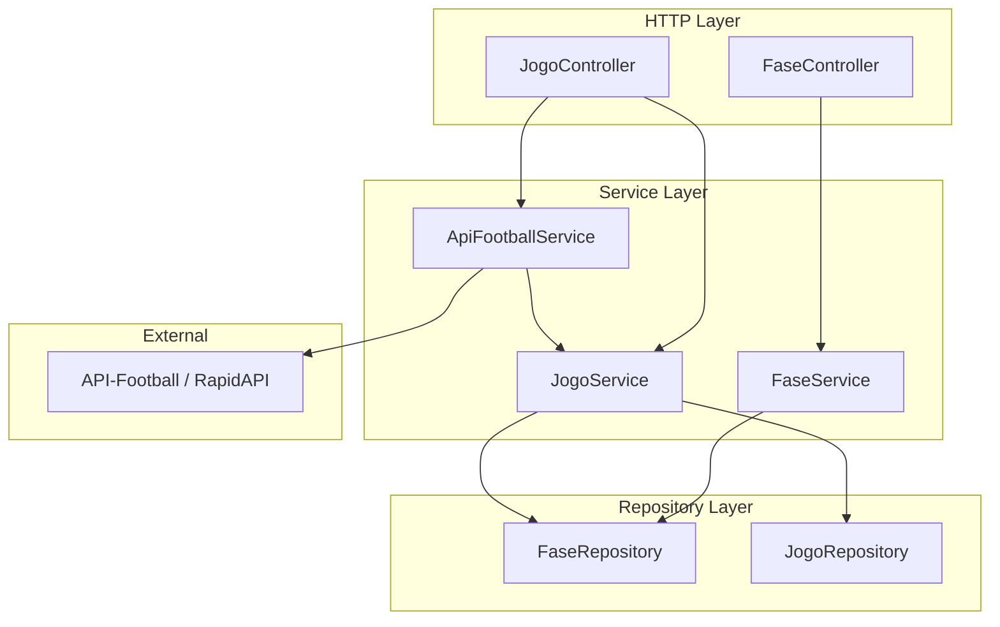
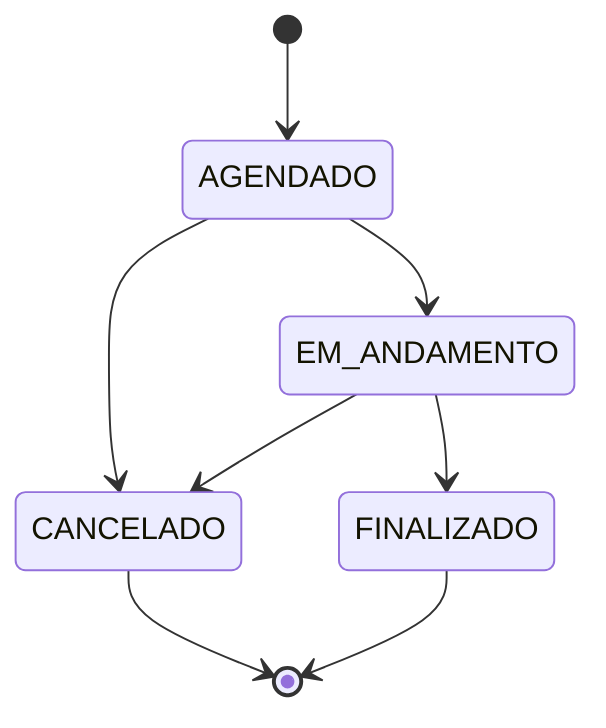

# Design — Módulo de Jogos

## Visão Geral

O módulo de Jogos gerencia partidas de futebol dentro de temporadas, organizadas em Fases. Suporta dois formatos de competição (Pontos Corridos e Mata-Mata), jogos de ida e volta, prorrogação e pênaltis. Integra com a API-Football para importação e sincronização de jogos, operando em modo híbrido (manual + API).

O módulo segue os padrões existentes do projeto: Repository Pattern, Domain Errors, Presenters, Guards globais e constantes por módulo.

## Arquitetura



### Decisões Arquiteturais

1. **Duas entidades separadas (Fase + Jogo)**: Fase agrupa jogos e define o formato da competição. Jogo contém placar e resultado.
2. **ApiFootballService isolado**: Responsável exclusivamente pela comunicação HTTP com a API-Football. Não acessa repositórios diretamente — delega criação/atualização ao JogoService.
3. **Cálculo de vencedor no JogoService**: Método `calcularVencedor()` centraliza a lógica de determinação do vencedor para todos os cenários (pontos corridos, mata-mata, ida/volta).
4. **fonteResultado como proteção**: Jogos com `fonteResultado = MANUAL` são ignorados na sincronização, protegendo edições manuais.

## Componentes e Interfaces

### FaseController

```typescript
@ApiTags(JOGOS.TAG)
@Controller('temporadas/:temporadaId/fases')
export class FaseController {
  criar(dto: CriarFaseDto): Promise<FasePresenter>
  listar(temporadaId: string): Promise<FasePresenter[]>
  buscarPorId(id: string): Promise<FasePresenter>
}
```

### JogoController

```typescript
@ApiTags(JOGOS.TAG)
@Controller('fases/:faseId/jogos')
export class JogoController {
  criar(dto: CriarJogoDto, user): Promise<JogoPresenter>
  atualizar(id: string, dto: AtualizarJogoDto): Promise<JogoPresenter>
  finalizar(id: string, dto: FinalizarJogoDto): Promise<JogoPresenter>
  listar(faseId: string): Promise<JogoPresenter[]>
  buscarPorId(id: string): Promise<JogoPresenter>
  importar(dto: ImportarJogosDto, user): Promise<{ importados: number }>
  sincronizar(faseId: string, user): Promise<{ sincronizados: number }>
  resetarFonte(id: string): Promise<JogoPresenter>
}
```

### FaseRepository Interface

```typescript
export interface FaseRepository {
  criar(data: CreateFaseData): Promise<Fase>
  buscarPorId(id: string): Promise<Fase | null>
  buscarPorTemporada(temporadaId: string): Promise<Fase[]>
}
```

### JogoRepository Interface

```typescript
export interface JogoRepository {
  criar(data: CreateJogoData): Promise<Jogo>
  atualizar(id: string, data: UpdateJogoData): Promise<Jogo>
  buscarPorId(id: string): Promise<Jogo | null>
  buscarPorFase(faseId: string): Promise<Jogo[]>
  buscarPorExternoId(externoId: string): Promise<Jogo | null>
  buscarPorGrupoIdaVolta(grupoIdaVolta: string): Promise<Jogo[]>
}
```

### JogoService — Métodos de Status Híbrido

```typescript
// Determina o status final do jogo priorizando API e usando fallback interno
definirStatusFinal(jogo: Jogo, statusApi?: string): StatusJogo

// Calcula status baseado na data/hora atual vs dataHora do jogo (fallback)
calcularStatusInterno(jogo: Jogo): StatusJogo

// Converte status da API-Football para enum StatusJogo interno
mapearStatus(statusApi: string): StatusJogo
```

#### Pseudocódigo

```
definirStatusFinal(jogo, statusApi?):
  SE jogo.status == FINALIZADO:
    RETORNAR FINALIZADO                    // nunca regredir

  SE statusApi fornecido:
    RETORNAR mapearStatus(statusApi)       // API tem prioridade

  RETORNAR calcularStatusInterno(jogo)     // fallback interno


calcularStatusInterno(jogo):
  agora = Date.now()
  SE agora < jogo.dataHora:
    RETORNAR AGENDADO
  SE agora <= jogo.dataHora + 2h:
    RETORNAR EM_ANDAMENTO
  RETORNAR FINALIZADO                      // estimativa após 2h


mapearStatus(statusApi):
  SCHEDULED        → AGENDADO
  LIVE, IN_PLAY    → EM_ANDAMENTO
  FINISHED         → FINALIZADO
  CANCELLED        → CANCELADO
  default          → AGENDADO
```

### ApiFootballService

```typescript
@Injectable()
export class ApiFootballService {
  buscarFixtures(leagueId: number, season: number): Promise<ApiFootballFixture[]>
  buscarFixturesPorIds(fixtureIds: number[]): Promise<ApiFootballFixture[]>
}
```

### DTOs

| DTO | Campos |
|-----|--------|
| CriarFaseDto | temporadaId, nome, tipo (PONTOS_CORRIDOS/MATA_MATA), ordem, idaVolta |
| CriarJogoDto | faseId, timeCasaId, timeForaId, dataHora, grupoIdaVolta?, ehJogoVolta? |
| AtualizarJogoDto | dataHora?, timeCasaId?, timeForaId?, status? |
| FinalizarJogoDto | golsCasa, golsFora, temProrrogacao?, golsProrrogacaoCasa?, golsProrrogacaoFora?, temPenaltis?, penaltisCasa?, penaltisFora? |
| ImportarJogosDto | leagueId, season, faseId |

### Domain Errors (jogos.errors.ts)

| Erro | Status | Cenário |
|------|--------|---------|
| FaseNaoEncontradaError | 404 | Fase não existe |
| JogoNaoEncontradoError | 404 | Jogo não existe |
| TimesIguaisError | 400 | timeCasaId === timeForaId |
| JogoFinalizadoError | 400 | Tentativa de alterar jogo finalizado |
| JogoCanceladoError | 400 | Tentativa de alterar jogo cancelado |
| PlacarInvalidoError | 400 | Gols negativos |
| ProrrogacaoNaoPermitidaError | 400 | Prorrogação em pontos corridos ou sem empate |
| PenaltisNaoPermitidoError | 400 | Pênaltis sem empate na prorrogação |
| PlacarPenaltisEmpatadoError | 400 | Pênaltis com placar empatado |
| VencedorObrigatorioError | 400 | Empate em mata-mata sem desempate |
| TransicaoStatusInvalidaError | 400 | Transição de status não permitida |
| IdaVoltaNaoPermitidaError | 400 | ehJogoVolta em fase sem idaVolta |
| JogoIdaNaoEncontradoError | 400 | Jogo de volta sem jogo de ida correspondente |
| ApiFootballIndisponivelError | 502 | API-Football fora do ar ou com erro |

### Presenters

```typescript
// FasePresenter.toHttp()
{ id, nome, tipo, ordem, idaVolta, temporadaId, dataCriacao }

// JogoPresenter.toHttp()
{ id, faseId, timeCasaId, timeForaId, dataHora, status, golsCasa, golsFora,
  temProrrogacao, golsProrrogacaoCasa, golsProrrogacaoFora,
  temPenaltis, penaltisCasa, penaltisFora,
  vencedorId, ehJogoVolta, grupoIdaVolta,
  fonteResultado, externoId, criadoPor, dataCriacao }
```

## Modelo de Dados

### Prisma Schema (novas entidades)

```prisma
enum TipoFase {
  PONTOS_CORRIDOS
  MATA_MATA
}

enum StatusJogo {
  AGENDADO
  EM_ANDAMENTO
  FINALIZADO
  CANCELADO
}

enum FonteResultado {
  MANUAL
  API_FOOTBALL
}

model Fase {
  id           String    @id @default(uuid())
  nome         String
  tipo         TipoFase
  ordem        Int
  idaVolta     Boolean   @default(false)
  temporadaId  String
  temporada    Temporada @relation(fields: [temporadaId], references: [id])

  jogos        Jogo[]

  dataCriacao  DateTime  @default(now())
}

model Jogo {
  id                     String         @id @default(uuid())
  faseId                 String
  fase                   Fase           @relation(fields: [faseId], references: [id])

  timeCasaId             String
  timeForaId             String
  dataHora               DateTime

  status                 StatusJogo     @default(AGENDADO)

  golsCasa               Int?
  golsFora               Int?
  temProrrogacao         Boolean        @default(false)
  golsProrrogacaoCasa    Int?
  golsProrrogacaoFora    Int?
  temPenaltis            Boolean        @default(false)
  penaltisCasa           Int?
  penaltisFora           Int?

  vencedorId             String?

  ehJogoVolta            Boolean        @default(false)
  grupoIdaVolta          String?

  fonteResultado         FonteResultado @default(MANUAL)
  externoId              String?        @unique

  criadoPor              String

  dataCriacao            DateTime       @default(now())
  atualizadoEm           DateTime       @updatedAt
}
```

### Relações adicionais

- `Temporada 1:N Fase` (adicionar `fases Fase[]` no model Temporada)
- `Fase 1:N Jogo`

### Mapeamento API-Football → StatusJogo

| API-Football Status | StatusJogo |
|---------------------|------------|
| NS (Not Started) | AGENDADO |
| 1H, 2H, HT | EM_ANDAMENTO |
| FT, AET, PEN | FINALIZADO |
| CANC, PST | CANCELADO |

### Transições de Status Válidas




## Propriedades de Corretude

*Uma propriedade é uma característica ou comportamento que deve ser verdadeiro em todas as execuções válidas de um sistema — essencialmente, uma declaração formal sobre o que o sistema deve fazer. Propriedades servem como ponte entre especificações legíveis por humanos e garantias de corretude verificáveis por máquina.*

### Propriedade 1: Round-trip de criação de Fase

*Para qualquer* conjunto válido de dados de fase (nome, tipo, ordem, idaVolta, temporadaId existente), criar a fase e buscá-la por ID deve retornar uma fase com os mesmos dados informados.

**Valida: Requisitos 1.1, 1.4**

### Propriedade 2: Listagem de fases ordenada por ordem

*Para qualquer* conjunto de fases pertencentes a uma mesma temporada com valores de ordem distintos, a listagem deve retornar as fases em ordem crescente do campo `ordem`.

**Valida: Requisito 1.3**

### Propriedade 3: Restrição idaVolta apenas em MATA_MATA

*Para qualquer* tentativa de criar uma fase com tipo PONTOS_CORRIDOS e idaVolta true, o serviço deve rejeitar a operação. idaVolta true só é aceito quando tipo é MATA_MATA.

**Valida: Requisito 1.6**

### Propriedade 4: Invariantes de criação de Jogo

*Para qualquer* jogo criado manualmente com dados válidos, o jogo resultante deve ter: status AGENDADO, todos os campos de placar null, fonteResultado MANUAL, e criadoPor igual ao ID do usuário autenticado.

**Valida: Requisitos 2.1, 2.6, 11.3**

### Propriedade 5: Times sempre diferentes

*Para qualquer* operação de criação ou atualização de jogo onde timeCasaId é igual a timeForaId, o serviço deve rejeitar com TimesIguaisError.

**Valida: Requisitos 2.2, 3.4**

### Propriedade 6: Pontos corridos ignora campos ida/volta

*Para qualquer* jogo criado em uma fase PONTOS_CORRIDOS, independentemente dos valores informados para grupoIdaVolta e ehJogoVolta, o jogo armazenado deve ter grupoIdaVolta null e ehJogoVolta false.

**Valida: Requisito 2.5**

### Propriedade 7: Imutabilidade após status terminal

*Para qualquer* jogo com status FINALIZADO ou CANCELADO, qualquer tentativa de atualização deve ser rejeitada com o erro correspondente (JogoFinalizadoError ou JogoCanceladoError).

**Valida: Requisitos 3.2, 3.3, 10.4**

### Propriedade 8: Vencedor em pontos corridos

*Para qualquer* jogo de fase PONTOS_CORRIDOS finalizado: se golsCasa > golsFora, vencedorId deve ser timeCasaId; se golsFora > golsCasa, vencedorId deve ser timeForaId; se golsCasa == golsFora, vencedorId deve ser null.

**Valida: Requisitos 4.3, 4.4, 7.1**

### Propriedade 9: Prorrogação proibida em pontos corridos

*Para qualquer* tentativa de finalizar um jogo de fase PONTOS_CORRIDOS com campos de prorrogação ou pênaltis preenchidos, o serviço deve rejeitar com ProrrogacaoNaoPermitidaError.

**Valida: Requisito 4.2**

### Propriedade 10: Placares são inteiros não negativos

*Para qualquer* valor de placar informado (golsCasa, golsFora, golsProrrogacaoCasa, golsProrrogacaoFora, penaltisCasa, penaltisFora), se o valor for negativo, o serviço deve rejeitar com PlacarInvalidoError.

**Valida: Requisitos 4.5, 9.1, 9.2, 9.3**

### Propriedade 11: Cascata de vencedor em mata-mata

*Para qualquer* jogo de fase MATA_MATA (sem ida/volta) finalizado: o vencedor é determinado primeiro pelo tempo normal, depois pela prorrogação (se houver empate), depois pelos pênaltis (se houver empate na prorrogação). O vencedorId resultante deve ser timeCasaId ou timeForaId.

**Valida: Requisitos 5.1, 5.6, 7.2**

### Propriedade 12: Empate em mata-mata exige desempate

*Para qualquer* jogo de fase MATA_MATA com empate no tempo normal (ou após prorrogação) sem mecanismo de desempate habilitado (temProrrogacao/temPenaltis false), o serviço deve rejeitar com VencedorObrigatorioError.

**Valida: Requisitos 5.3, 5.5**

### Propriedade 13: Sequenciamento de prorrogação e pênaltis

*Para qualquer* jogo de fase MATA_MATA: prorrogação só é permitida se houver empate no tempo normal; pênaltis só são permitidos se houver empate na prorrogação; pênaltis nunca podem terminar empatados.

**Valida: Requisitos 5.7, 5.8, 5.9**

### Propriedade 14: Restrições de ida e volta

*Para qualquer* jogo com ehJogoVolta true: a fase deve ter idaVolta habilitado, deve existir um jogo de ida com o mesmo grupoIdaVolta, e prorrogação/pênaltis só são permitidos no jogo de volta. Jogos de ida finalizados devem ter vencedorId null.

**Valida: Requisitos 6.2, 6.3, 6.4, 6.5**

### Propriedade 15: Vencedor por placar agregado

*Para qualquer* par de jogos ida/volta finalizados com o mesmo grupoIdaVolta, o vencedorId do jogo de volta deve ser calculado pelo placar agregado (soma dos gols dos dois jogos), usando prorrogação e pênaltis do jogo de volta em caso de empate agregado.

**Valida: Requisito 7.3**

### Propriedade 16: Invariante de vencedorId

*Para qualquer* jogo com vencedorId não null, o valor deve ser igual a timeCasaId ou timeForaId daquele jogo.

**Valida: Requisitos 7.4, 9.7**

### Propriedade 17: Jogo não finalizado tem placares null

*Para qualquer* jogo com status diferente de FINALIZADO, todos os campos de placar (golsCasa, golsFora, golsProrrogacaoCasa, golsProrrogacaoFora, penaltisCasa, penaltisFora) e vencedorId devem ser null.

**Valida: Requisito 9.6**

### Propriedade 18: Consistência de campos de placar

*Para qualquer* jogo: se temProrrogacao é false, golsProrrogacaoCasa e golsProrrogacaoFora devem ser null; se temPenaltis é false, penaltisCasa e penaltisFora devem ser null.

**Valida: Requisitos 9.4, 9.5**

### Propriedade 19: Transições de status válidas

*Para qualquer* jogo e qualquer par (statusAtual, novoStatus): apenas as transições AGENDADO→EM_ANDAMENTO, AGENDADO→CANCELADO, EM_ANDAMENTO→FINALIZADO, EM_ANDAMENTO→CANCELADO são permitidas. Qualquer outra transição deve ser rejeitada com TransicaoStatusInvalidaError.

**Valida: Requisitos 10.2, 10.3**

### Propriedade 20: Listagem de jogos ordenada por dataHora

*Para qualquer* conjunto de jogos pertencentes a uma mesma fase, a listagem deve retornar os jogos em ordem crescente do campo `dataHora`.

**Valida: Requisito 8.1**

### Propriedade 21: Presenter expõe apenas campos permitidos (allowlist)

*Para qualquer* jogo ou fase, o resultado de toHttp() deve conter exatamente os campos definidos na allowlist do presenter, incluindo fonteResultado para jogos.

**Valida: Requisitos 8.3, 8.4, 14.4**

### Propriedade 22: Mapeamento de status API-Football

*Para qualquer* fixture da API-Football, o status deve ser mapeado corretamente: NS→AGENDADO, (1H|2H|HT)→EM_ANDAMENTO, (FT|AET|PEN)→FINALIZADO, (CANC|PST)→CANCELADO.

**Valida: Requisitos 12.3, 12.4, 12.5, 12.6**

### Propriedade 23: Idempotência de importação

*Para qualquer* fixture com externoId já existente no banco, a importação deve ignorar o fixture duplicado sem criar um novo jogo. Importar a mesma lista de fixtures duas vezes deve resultar no mesmo número de jogos.

**Valida: Requisitos 12.7, 11.5**

### Propriedade 24: Sincronização respeita fonteResultado

*Para qualquer* jogo durante sincronização: se fonteResultado é API_FOOTBALL, o placar deve ser atualizado; se fonteResultado é MANUAL, o jogo deve permanecer inalterado.

**Valida: Requisitos 13.2, 13.3**

### Propriedade 25: Edição manual altera fonteResultado

*Para qualquer* jogo com fonteResultado API_FOOTBALL, quando o placar é editado manualmente, fonteResultado deve ser alterado para MANUAL.

**Valida: Requisito 14.1**

### Propriedade 26: Criação manual não afeta jogos importados

*Para qualquer* fase contendo jogos importados (fonteResultado API_FOOTBALL), criar um novo jogo manualmente não deve alterar nenhum campo dos jogos importados existentes.

**Valida: Requisito 14.2**

### Propriedade 27: Reset de fonteResultado

*Para qualquer* jogo com fonteResultado MANUAL, chamar o endpoint de reset deve alterar fonteResultado para API_FOOTBALL, permitindo que sincronizações futuras atualizem o jogo.

**Valida: Requisito 14.5**

### Propriedade 28: Não-regressão de status

*Para qualquer* jogo com status FINALIZADO e qualquer valor de statusApi (incluindo undefined), `definirStatusFinal()` deve retornar FINALIZADO. O status nunca regride de FINALIZADO para EM_ANDAMENTO ou AGENDADO.

**Valida: Requisitos 15.2, 15.10**

### Propriedade 29: Prioridade da API sobre fallback

*Para qualquer* jogo com status diferente de FINALIZADO e com statusApi fornecido, `definirStatusFinal()` deve retornar o resultado de `mapearStatus(statusApi)`, ignorando o cálculo interno baseado em tempo.

**Valida: Requisito 15.3**

### Propriedade 30: Fallback baseado em tempo

*Para qualquer* jogo com status diferente de FINALIZADO e sem statusApi fornecido, `definirStatusFinal()` deve retornar: AGENDADO se a data atual é anterior a dataHora do jogo, EM_ANDAMENTO se a data atual está entre dataHora e dataHora + 2 horas, FINALIZADO se a data atual é posterior a dataHora + 2 horas.

**Valida: Requisitos 15.4, 15.5, 15.6, 15.7**

## Tratamento de Erros

### Domain Errors

Todos os erros de negócio são classes que estendem `DomainError`, capturados pelo `DomainExceptionFilter`:

| Erro | Status | Módulo |
|------|--------|--------|
| FaseNaoEncontradaError | 404 | jogos |
| JogoNaoEncontradoError | 404 | jogos |
| TemporadaNaoEncontradaError | 404 | temporadas (reuso) |
| TimesIguaisError | 400 | jogos |
| JogoFinalizadoError | 400 | jogos |
| JogoCanceladoError | 400 | jogos |
| PlacarInvalidoError | 400 | jogos |
| ProrrogacaoNaoPermitidaError | 400 | jogos |
| PenaltisNaoPermitidoError | 400 | jogos |
| PlacarPenaltisEmpatadoError | 400 | jogos |
| VencedorObrigatorioError | 400 | jogos |
| TransicaoStatusInvalidaError | 400 | jogos |
| IdaVoltaNaoPermitidaError | 400 | jogos |
| JogoIdaNaoEncontradoError | 400 | jogos |
| ApiFootballIndisponivelError | 502 | jogos |

### Erros de API Externa

- Timeout/erro de rede na API-Football → `ApiFootballIndisponivelError` (502)
- Fixture não encontrado durante sync → log de aviso, continua processando demais jogos
- Rate limit excedido → `ApiFootballIndisponivelError` com mensagem específica

### Resiliência a Falhas de API

- **API indisponível**: O `JogoService` usa `calcularStatusInterno()` como fallback automático para determinar status dos jogos. Registra log de aviso indicando uso do fallback.
- **Dados parciais**: Quando a API retorna status apenas para alguns fixtures, o `JogoService` aplica fallback seletivo — usa `mapearStatus()` para jogos com statusApi e `calcularStatusInterno()` para os demais.
- **Operações do usuário nunca bloqueadas**: Falhas na API externa não propagam exceções para endpoints de consulta ou criação manual. Apenas endpoints de importação/sincronização reportam `ApiFootballIndisponivelError` quando a API é estritamente necessária.

### Validação de DTOs

- Campos obrigatórios ausentes → 400 via class-validator (mensagens em pt-BR)
- UUID inválido em params → 400 via ParseUUIDCustomPipe
- Enum inválido → 400 via class-validator

## Estratégia de Testes

### Abordagem Dual

O módulo utiliza testes unitários e testes baseados em propriedades de forma complementar:

- **Testes unitários**: Exemplos específicos, edge cases, integração entre componentes
- **Testes de propriedade**: Propriedades universais verificadas com inputs gerados aleatoriamente

### Biblioteca de Property-Based Testing

- **fast-check** (via Vitest) — biblioteca PBT para TypeScript
- Cada teste de propriedade deve rodar no mínimo 100 iterações
- Cada teste deve referenciar a propriedade do design com tag no formato:
  `Feature: modulo-jogos, Property {N}: {título}`

### Estrutura de Testes

```
src/modules/jogos/
├── fase.service.spec.ts          # Unit tests FaseService
├── jogo.service.spec.ts          # Unit tests JogoService
├── jogo.service.pbt.spec.ts      # Property tests JogoService
├── fase.service.pbt.spec.ts      # Property tests FaseService
├── api-football.service.spec.ts  # Unit tests ApiFootballService
├── jogo.controller.spec.ts       # Unit tests JogoController
└── fase.controller.spec.ts       # Unit tests FaseController
```

### Testes Unitários (exemplos e edge cases)

- Criação de fase com temporadaId inexistente → TemporadaNaoEncontradaError
- Criação de jogo com faseId inexistente → FaseNaoEncontradaError
- Finalização com placar 0x0 em pontos corridos → empate (vencedorId null)
- Finalização mata-mata com pênaltis 5x4 → vencedor correto
- Importação com API indisponível → ApiFootballIndisponivelError
- Sync com fixture não encontrado → log + continua

### Testes de Propriedade (cada propriedade = 1 teste PBT)

Cada uma das 30 propriedades listadas na seção de Corretude deve ser implementada como um único teste baseado em propriedades usando fast-check. Os testes usam InMemory repositories para isolamento.

Generators necessários:
- `arbFase()` — gera Fase válida com tipo e idaVolta consistentes
- `arbJogo()` — gera Jogo válido com campos consistentes ao tipo da fase
- `arbJogoComStatus(status)` — gera Jogo válido com status específico (para testes de não-regressão)
- `arbPlacar()` — gera inteiros não negativos para placares
- `arbFinalizacao(tipo)` — gera FinalizarJogoDto válido para o tipo de fase
- `arbFixture()` — gera fixture da API-Football com status e placar
- `arbStatusJogo()` — gera StatusJogo aleatório
- `arbTransicao()` — gera par (statusAtual, novoStatus)
- `arbStatusApi()` — gera string de status da API-Football (SCHEDULED, LIVE, IN_PLAY, FINISHED, CANCELLED) ou undefined
- `arbDataHoraRelativa()` — gera dataHora relativa ao momento atual (passado, presente, futuro) para testes de fallback temporal
