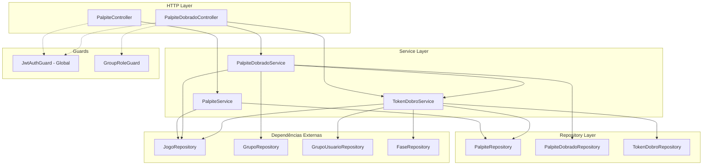

# Documento de Design — Módulo Palpites

## Visão Geral

O módulo Palpites implementa o gerenciamento de palpites (previsões de placar) para jogos de futebol, incluindo a mecânica de Palpite Dobrado. O módulo é dividido em dois subdomínios:

1. **Palpites Universais**: CRUD de palpites vinculados a (usuarioId, jogoId), sem relação direta com grupo. Um palpite vale para todos os grupos dos quais o usuário participa.
2. **Palpite Dobrado**: Mecânica opcional por grupo que permite multiplicar por 2x os pontos de um palpite. Envolve Token_Dobro (fichas acumuladas por conquistas) e PalpiteDobrado (ativação do dobro em um jogo específico dentro de um grupo).

### Decisões de Design

- **Palpite é universal**: A constraint `@@unique([usuarioId, jogoId])` garante um único palpite por usuário por jogo. A associação com grupo é indireta via GrupoUsuario.
- **PalpiteDobrado é por grupo**: A constraint `@@unique([usuarioId, jogoId, grupoId])` permite que o mesmo palpite seja dobrado em um grupo e não em outro.
- **TokenDobro como log de eventos**: Cada concessão e utilização é registrada como um evento imutável com `tipo` (CONCESSAO/UTILIZACAO), permitindo auditoria completa. O saldo é calculado pela diferença entre concessões e utilizações.
- **Separação de responsabilidades**: O módulo terá services especializados — `PalpiteService` para CRUD de palpites, `PalpiteDobradoService` para a mecânica de dobro, e `TokenDobroService` para gestão de fichas.
- **Concessão de tokens é event-driven**: Os tokens são concedidos quando eventos específicos ocorrem (jogo finalizado, fase encerrada). O `TokenDobroService` expõe métodos que serão chamados pelo service que processa finalizações de jogos.

## Arquitetura



### Fluxo de Dados

1. **Criar/Editar/Excluir Palpite**: `PalpiteController` → `PalpiteService` → `PalpiteRepository` + `JogoRepository` (validação de status)
2. **Ativar/Desativar Dobro**: `PalpiteDobradoController` → `PalpiteDobradoService` → `PalpiteDobradoRepository` + `TokenDobroService` (saldo) + `JogoRepository` (status) + `GrupoRepository` (config)
3. **Concessão de Tokens**: `TokenDobroService` é chamado por processos de finalização de jogo/fase → `TokenDobroRepository` + `GrupoUsuarioRepository` (membros) + `PalpiteRepository` (verificação de palpites completos)
4. **Consulta de Saldo/Histórico**: `PalpiteDobradoController` → `TokenDobroService` → `TokenDobroRepository`

## Componentes e Interfaces

### Controllers

#### PalpiteController
- `POST /jogos/:jogoId/palpites` — Criar palpite (JWT global, sem guard adicional)
- `PATCH /palpites/:id` — Editar palpite (JWT global, validação de ownership no service)
- `DELETE /palpites/:id` — Excluir palpite (JWT global, validação de ownership no service)
- `GET /jogos/:jogoId/meu-palpite` — Buscar meu palpite por jogo (JWT global)
- `GET /meus-palpites` — Listar meus palpites com filtro opcional por temporadaId (JWT global)
- `GET /grupos/:grupoId/jogos/:jogoId/palpites` — Listar palpites por jogo no contexto de grupo (GroupRoleGuard ADMIN|MEMBER)

#### PalpiteDobradoController
- `POST /grupos/:grupoId/jogos/:jogoId/dobro` — Ativar dobro (GroupRoleGuard ADMIN|MEMBER)
- `DELETE /grupos/:grupoId/jogos/:jogoId/dobro` — Desativar dobro (GroupRoleGuard ADMIN|MEMBER)
- `GET /grupos/:grupoId/tokens-dobro/saldo` — Consultar saldo (GroupRoleGuard ADMIN|MEMBER)
- `GET /grupos/:grupoId/tokens-dobro/historico` — Consultar histórico (GroupRoleGuard ADMIN|MEMBER)
- `PATCH /grupos/:grupoId/configuracao-dobro` — Habilitar/desabilitar dobro no grupo (GroupRoleGuard ADMIN)

### Repository Interfaces

#### PalpiteRepository
```typescript
export interface PalpiteRepository {
  criar(data: { usuarioId: string; jogoId: string; golsCasa: number; golsFora: number }): Promise<any>;
  atualizar(id: string, data: { golsCasa: number; golsFora: number }): Promise<any>;
  remover(id: string): Promise<void>;
  buscarPorId(id: string): Promise<any>;
  buscarPorUsuarioEJogo(usuarioId: string, jogoId: string): Promise<any>;
  listarPorUsuario(usuarioId: string, filtros?: { temporadaId?: string }): Promise<any[]>;
  listarPorJogoEUsuarios(jogoId: string, usuarioIds: string[]): Promise<any[]>;
  listarPorFaseEUsuario(faseId: string, usuarioId: string): Promise<any[]>;
}
```

#### PalpiteDobradoRepository
```typescript
export interface PalpiteDobradoRepository {
  criar(data: { usuarioId: string; jogoId: string; grupoId: string }): Promise<any>;
  remover(usuarioId: string, jogoId: string, grupoId: string): Promise<void>;
  buscarPorChave(usuarioId: string, jogoId: string, grupoId: string): Promise<any>;
  listarPorJogoEGrupo(jogoId: string, grupoId: string): Promise<any[]>;
}
```

#### TokenDobroRepository
```typescript
export interface TokenDobroRepository {
  criar(data: {
    usuarioId: string;
    grupoId: string;
    tipo: 'CONCESSAO' | 'UTILIZACAO';
    motivo: 'PALPITES_COMPLETOS' | 'ACERTO_EM_CHEIO' | 'ULTIMO_RANKING' | 'PRIMEIRO_RANKING' | 'ATIVACAO_DOBRO' | 'CANCELAMENTO_DOBRO';
    referenciaId: string;
  }): Promise<any>;
  calcularSaldo(usuarioId: string, grupoId: string): Promise<number>;
  listarPorUsuarioEGrupo(usuarioId: string, grupoId: string): Promise<any[]>;
}
```

### Services

#### PalpiteService
- `criar(dto, usuarioId)` — Valida jogo (existe + AGENDADO), verifica unicidade, cria palpite
- `atualizar(id, dto, usuarioId)` — Valida ownership, valida jogo AGENDADO, atualiza
- `remover(id, usuarioId)` — Valida ownership, valida jogo AGENDADO, remove
- `buscarMeuPalpitePorJogo(jogoId, usuarioId)` — Busca palpite do usuário para o jogo
- `listarMeusPalpites(usuarioId, filtros?)` — Lista palpites do usuário com filtro opcional
- `listarPorJogoNoGrupo(jogoId, grupoId, usuarioId)` — Aplica regra de visibilidade (FINALIZADO = todos, senão = só o próprio)

#### PalpiteDobradoService
- `ativarDobro(grupoId, jogoId, usuarioId)` — Valida grupo com dobro habilitado, jogo AGENDADO, saldo > 0, unicidade, cria PalpiteDobrado + registra utilização de token
- `desativarDobro(grupoId, jogoId, usuarioId)` — Valida jogo AGENDADO, existência do dobro, remove PalpiteDobrado + registra devolução de token
- `atualizarConfiguracaoDobro(grupoId, habilitado)` — Atualiza campo `palpiteDobradoHabilitado` no grupo

#### TokenDobroService
- `calcularSaldo(usuarioId, grupoId)` — Retorna saldo atual
- `listarHistorico(usuarioId, grupoId)` — Retorna lista de eventos
- `concederPorPalpitesCompletos(faseId, grupoId)` — Verifica quais membros completaram todos os palpites da fase antes do primeiro jogo
- `concederPorAcertoEmCheio(jogoId, grupoId)` — Verifica quais membros acertaram o placar exato
- `concederPorRankingFase(faseId, grupoId, posicao: 'primeiro' | 'ultimo')` — Concede token ao primeiro/último do ranking da fase

### Presenters

#### PalpitePresenter
```typescript
export class PalpitePresenter {
  static toHttp(palpite: any) {
    return {
      id: palpite.id,
      golsCasa: palpite.golsCasa,
      golsFora: palpite.golsFora,
      jogoId: palpite.jogoId,
      usuarioId: palpite.usuarioId,
      dataCriacao: palpite.dataCriacao,
    };
  }
}
```

#### PalpiteDobradoPresenter
```typescript
export class PalpiteDobradoPresenter {
  static toHttp(palpiteDobrado: any) {
    return {
      id: palpiteDobrado.id,
      usuarioId: palpiteDobrado.usuarioId,
      jogoId: palpiteDobrado.jogoId,
      grupoId: palpiteDobrado.grupoId,
      dataCriacao: palpiteDobrado.dataCriacao,
    };
  }
}
```

#### TokenDobroPresenter
```typescript
export class TokenDobroPresenter {
  static toHttp(token: any) {
    return {
      id: token.id,
      usuarioId: token.usuarioId,
      grupoId: token.grupoId,
      motivo: token.motivo,
      referenciaId: token.referenciaId,
      tipo: token.tipo,
      dataCriacao: token.dataCriacao,
    };
  }
}
```

### Domain Errors

```typescript
// src/common/errors/domain-errors/palpites.errors.ts

export class PalpiteNaoEncontradoError extends DomainError {
  readonly statusCode = 404;
}

export class JogoNaoAceitaPalpitesError extends DomainError {
  readonly statusCode = 400;
}

export class PalpiteJaExisteError extends DomainError {
  readonly statusCode = 409;
}

export class PalpiteNaoPertenceAoUsuarioError extends DomainError {
  readonly statusCode = 403;
}

export class GrupoNaoPermiteDobroError extends DomainError {
  readonly statusCode = 400;
}

export class SemFichasDobroError extends DomainError {
  readonly statusCode = 400;
}

export class DobroJaAtivoError extends DomainError {
  readonly statusCode = 409;
}

export class DobroNaoEncontradoError extends DomainError {
  readonly statusCode = 404;
}

export class JogoNaoAceitaDobroError extends DomainError {
  readonly statusCode = 400;
}
```

### Constants

```typescript
// src/modules/palpites/palpites.constants.ts

export const PALPITES = {
  TAG: 'Palpites',
  PALPITE_REPOSITORY_TOKEN: 'PALPITE_REPOSITORY',
  PALPITE_DOBRADO_REPOSITORY_TOKEN: 'PALPITE_DOBRADO_REPOSITORY',
  TOKEN_DOBRO_REPOSITORY_TOKEN: 'TOKEN_DOBRO_REPOSITORY',
  MENSAGENS: {
    PALPITE_NAO_ENCONTRADO: 'Palpite não encontrado',
    JOGO_NAO_ACEITA_PALPITES: 'O jogo não aceita mais palpites',
    PALPITE_JA_EXISTE: 'Já existe um palpite para este jogo',
    PALPITE_NAO_PERTENCE_AO_USUARIO: 'Este palpite não pertence ao usuário',
    PALPITE_CRIADO: 'Palpite criado com sucesso',
    PALPITE_ATUALIZADO: 'Palpite atualizado com sucesso',
    PALPITE_EXCLUIDO: 'Palpite excluído com sucesso',
    GRUPO_NAO_PERMITE_DOBRO: 'O grupo não permite palpite dobrado',
    SEM_FICHAS_DOBRO: 'Você não possui fichas de dobro disponíveis',
    DOBRO_JA_ATIVO: 'Já existe dobro ativo para este jogo neste grupo',
    DOBRO_NAO_ENCONTRADO: 'Não existe dobro ativo para este jogo neste grupo',
    JOGO_NAO_ACEITA_DOBRO: 'O jogo não aceita mais ativação de dobro',
    DOBRO_ATIVADO: 'Palpite dobrado ativado com sucesso',
    DOBRO_DESATIVADO: 'Palpite dobrado desativado com sucesso',
    CONFIGURACAO_ATUALIZADA: 'Configuração de palpite dobrado atualizada',
  },
} as const;
```

## Modelos de Dados

### Alterações no Schema Prisma

#### Novo campo no model Grupo
```prisma
model Grupo {
  // ... campos existentes ...
  palpiteDobradoHabilitado Boolean @default(false)
}
```

#### Novo model: Palpite
```prisma
model Palpite {
  id         String   @id @default(uuid())
  usuarioId  String
  jogoId     String
  golsCasa   Int
  golsFora   Int
  dataCriacao DateTime @default(now())
  atualizadoEm DateTime @updatedAt

  usuario    Usuario  @relation(fields: [usuarioId], references: [id])
  jogo       Jogo     @relation(fields: [jogoId], references: [id])

  @@unique([usuarioId, jogoId])
  @@index([jogoId])
  @@index([usuarioId])
}
```

#### Novo model: PalpiteDobrado
```prisma
model PalpiteDobrado {
  id         String   @id @default(uuid())
  usuarioId  String
  jogoId     String
  grupoId    String
  dataCriacao DateTime @default(now())

  usuario    Usuario  @relation(fields: [usuarioId], references: [id])
  jogo       Jogo     @relation(fields: [jogoId], references: [id])
  grupo      Grupo    @relation(fields: [grupoId], references: [id])

  @@unique([usuarioId, jogoId, grupoId])
  @@index([jogoId, grupoId])
}
```

#### Novo enum: TipoTokenDobro
```prisma
enum TipoTokenDobro {
  CONCESSAO
  UTILIZACAO
}
```

#### Novo enum: MotivoTokenDobro
```prisma
enum MotivoTokenDobro {
  PALPITES_COMPLETOS
  ACERTO_EM_CHEIO
  ULTIMO_RANKING
  PRIMEIRO_RANKING
  ATIVACAO_DOBRO
  CANCELAMENTO_DOBRO
}
```

#### Novo model: TokenDobro
```prisma
model TokenDobro {
  id           String           @id @default(uuid())
  usuarioId    String
  grupoId      String
  tipo         TipoTokenDobro
  motivo       MotivoTokenDobro
  referenciaId String
  dataCriacao  DateTime         @default(now())

  usuario      Usuario          @relation(fields: [usuarioId], references: [id])
  grupo        Grupo            @relation(fields: [grupoId], references: [id])

  @@index([usuarioId, grupoId])
}
```

### Relações adicionadas

- `Usuario` 1:N `Palpite`
- `Jogo` 1:N `Palpite`
- `Usuario` 1:N `PalpiteDobrado`
- `Jogo` 1:N `PalpiteDobrado`
- `Grupo` 1:N `PalpiteDobrado`
- `Usuario` 1:N `TokenDobro`
- `Grupo` 1:N `TokenDobro`

### Cálculo de Saldo de TokenDobro

O saldo é calculado pela diferença entre registros com `tipo = CONCESSAO` e `tipo = UTILIZACAO`:

```sql
SELECT
  COUNT(*) FILTER (WHERE tipo = 'CONCESSAO') -
  COUNT(*) FILTER (WHERE tipo = 'UTILIZACAO') AS saldo
FROM "TokenDobro"
WHERE "usuarioId" = ? AND "grupoId" = ?
```

Motivos de CONCESSAO: `PALPITES_COMPLETOS`, `ACERTO_EM_CHEIO`, `ULTIMO_RANKING`, `PRIMEIRO_RANKING`, `CANCELAMENTO_DOBRO`
Motivos de UTILIZACAO: `ATIVACAO_DOBRO`


## Propriedades de Corretude

*Uma propriedade é uma característica ou comportamento que deve ser verdadeiro em todas as execuções válidas de um sistema — essencialmente, uma declaração formal sobre o que o sistema deve fazer. Propriedades servem como ponte entre especificações legíveis por humanos e garantias de corretude verificáveis por máquina.*

### Propriedade 1: Criação de palpite persiste dados corretamente

*Para qualquer* jogo com status AGENDADO e quaisquer valores válidos de golsCasa e golsFora (inteiros ≥ 0), criar um palpite e depois buscá-lo deve retornar os mesmos valores de golsCasa, golsFora, jogoId e usuarioId.

**Valida: Requisitos 1.1, 4.1**

### Propriedade 2: Operações em palpite rejeitadas quando jogo não é AGENDADO

*Para qualquer* jogo com status diferente de AGENDADO (EM_ANDAMENTO, FINALIZADO, CANCELADO) e qualquer operação de palpite (criar, editar, excluir), o sistema deve rejeitar a operação com o erro apropriado.

**Valida: Requisitos 1.2, 2.2, 3.2**

### Propriedade 3: Unicidade de palpite por usuário e jogo

*Para qualquer* usuário e jogo onde já existe um palpite registrado, tentar criar outro palpite para o mesmo par (usuarioId, jogoId) deve ser rejeitado com erro de duplicidade.

**Valida: Requisitos 1.3, 7.1, 7.2**

### Propriedade 4: Validação de gols rejeita valores inválidos

*Para qualquer* valor de golsCasa ou golsFora que seja negativo, a criação ou edição de palpite deve ser rejeitada com erro de validação.

**Valida: Requisito 1.4**

### Propriedade 5: Edição de palpite atualiza dados corretamente

*Para qualquer* palpite existente em um jogo AGENDADO, atualizar golsCasa e golsFora e depois buscar o palpite deve retornar os novos valores.

**Valida: Requisito 2.1**

### Propriedade 6: Ownership impede operações de outro usuário

*Para qualquer* palpite pertencente a um usuário A, um usuário B diferente não deve conseguir editar nem excluir esse palpite, recebendo erro de permissão.

**Valida: Requisitos 2.3, 3.3**

### Propriedade 7: Exclusão remove palpite permanentemente

*Para qualquer* palpite existente em um jogo AGENDADO, após exclusão pelo proprietário, buscar o palpite por id deve retornar não encontrado.

**Valida: Requisito 3.1**

### Propriedade 8: Visibilidade de palpites por status do jogo no contexto de grupo

*Para qualquer* jogo e grupo, se o jogo está FINALIZADO, listar palpites no grupo deve retornar os palpites de todos os membros que possuem palpite; se o jogo NÃO está FINALIZADO, deve retornar apenas o palpite do usuário solicitante.

**Valida: Requisitos 5.1, 5.2**

### Propriedade 9: Filtro de palpites por temporada

*Para qualquer* usuário com palpites em jogos de múltiplas temporadas, filtrar por temporadaId deve retornar apenas palpites cujos jogos pertencem a fases da temporada especificada.

**Valida: Requisito 6.2**

### Propriedade 10: Presenters retornam apenas campos da allowlist

*Para qualquer* objeto de Palpite, PalpiteDobrado ou TokenDobro (incluindo campos extras não previstos), o respectivo Presenter.toHttp deve retornar um objeto contendo exatamente os campos especificados na allowlist e nenhum campo adicional.

**Valida: Requisitos 8.1, 8.2, 16.1, 16.2, 16.3**

### Propriedade 11: Ativação de dobro decrementa saldo e cria registro

*Para qualquer* membro de um grupo com dobro habilitado, com saldo de TokenDobro > 0, para um jogo AGENDADO, ativar o dobro deve criar um registro PalpiteDobrado e o saldo deve diminuir em 1.

**Valida: Requisito 11.1**

### Propriedade 12: Desativação de dobro incrementa saldo e remove registro

*Para qualquer* PalpiteDobrado ativo em um jogo AGENDADO, desativar o dobro deve remover o registro e o saldo de TokenDobro deve aumentar em 1.

**Valida: Requisito 12.1**

### Propriedade 13: Ativação de dobro round-trip com desativação preserva saldo

*Para qualquer* membro com saldo S, ativar o dobro e depois desativá-lo deve resultar no saldo retornando a S.

**Valida: Requisitos 11.1, 12.1**

### Propriedade 14: Rejeição de dobro quando jogo não é AGENDADO

*Para qualquer* jogo com status diferente de AGENDADO, ativar ou desativar dobro deve ser rejeitado com erro apropriado.

**Valida: Requisitos 11.2, 12.2**

### Propriedade 15: Rejeição de dobro com saldo zero

*Para qualquer* membro com saldo de TokenDobro igual a zero, tentar ativar o dobro deve ser rejeitado com erro informando falta de fichas.

**Valida: Requisito 11.3**

### Propriedade 16: Unicidade de PalpiteDobrado por (usuário, jogo, grupo)

*Para qualquer* PalpiteDobrado existente, tentar criar outro para o mesmo (usuarioId, jogoId, grupoId) deve ser rejeitado com erro de duplicidade.

**Valida: Requisitos 11.4, 15.1, 15.2**

### Propriedade 17: Rejeição de dobro em grupo sem dobro habilitado

*Para qualquer* grupo com palpiteDobradoHabilitado = false, tentar ativar dobro deve ser rejeitado, e nenhum token deve ser concedido por conquistas.

**Valida: Requisitos 11.5, 10.7**

### Propriedade 18: Concessão de token por palpites completos na fase

*Para qualquer* membro de um grupo com dobro habilitado que possui palpites para todos os jogos de uma fase, registrados antes do dataHora do primeiro jogo da fase, o sistema deve conceder exatamente 1 TokenDobro com motivo PALPITES_COMPLETOS.

**Valida: Requisito 10.1**

### Propriedade 19: Concessão de token por acerto em cheio

*Para qualquer* jogo finalizado em um grupo com dobro habilitado, se o palpite de um membro possui golsCasa e golsFora iguais ao placar final do jogo, o sistema deve conceder 1 TokenDobro com motivo ACERTO_EM_CHEIO.

**Valida: Requisito 10.2**

### Propriedade 20: Concessão de token por posição no ranking da fase

*Para qualquer* fase encerrada (todos os jogos FINALIZADO ou CANCELADO) em um grupo com dobro habilitado, o membro na primeira posição do ranking deve receber 1 TokenDobro com motivo PRIMEIRO_RANKING, e o membro na última posição deve receber 1 TokenDobro com motivo ULTIMO_RANKING.

**Valida: Requisitos 10.3, 10.4**

### Propriedade 21: Saldo de tokens é diferença entre concessões e utilizações

*Para qualquer* sequência de concessões e utilizações de TokenDobro de um usuário em um grupo, o saldo retornado deve ser igual à contagem de registros CONCESSAO menos a contagem de registros UTILIZACAO.

**Valida: Requisitos 13.1, 10.6**

### Propriedade 22: Registro de token contém dados completos

*Para qualquer* TokenDobro concedido, o registro deve conter usuarioId, grupoId, motivo, referenciaId (faseId ou jogoId), tipo e dataCriacao corretos.

**Valida: Requisito 10.5**

### Propriedade 23: Multiplicador de dobro aplicado corretamente no ranking

*Para qualquer* jogo finalizado em um grupo, se o membro possui PalpiteDobrado ativo, os pontos do palpite devem ser multiplicados por 2; caso contrário, multiplicados por 1. O multiplicador deve ser aplicado apenas no grupo onde o PalpiteDobrado foi ativado.

**Valida: Requisitos 14.1, 14.2, 14.3**

### Propriedade 24: Desabilitar dobro preserva tokens mas impede novas ativações

*Para qualquer* grupo que tinha dobro habilitado e é desabilitado, os TokenDobro existentes devem permanecer no banco, mas novas ativações de dobro devem ser rejeitadas.

**Valida: Requisito 9.4**

## Tratamento de Erros

### Domain Errors do Módulo

| Erro | Status HTTP | Quando |
|------|-------------|--------|
| `PalpiteNaoEncontradoError` | 404 | Palpite não existe |
| `JogoNaoAceitaPalpitesError` | 400 | Jogo com status ≠ AGENDADO |
| `PalpiteJaExisteError` | 409 | Violação de unicidade (usuarioId, jogoId) |
| `PalpiteNaoPertenceAoUsuarioError` | 403 | Tentativa de editar/excluir palpite de outro usuário |
| `GrupoNaoPermiteDobroError` | 400 | Grupo com palpiteDobradoHabilitado = false |
| `SemFichasDobroError` | 400 | Saldo de TokenDobro = 0 |
| `DobroJaAtivoError` | 409 | Violação de unicidade (usuarioId, jogoId, grupoId) |
| `DobroNaoEncontradoError` | 404 | PalpiteDobrado não existe para desativação |
| `JogoNaoAceitaDobroError` | 400 | Jogo com status ≠ AGENDADO para operação de dobro |

### Erros Reutilizados de Outros Módulos

| Erro | Módulo Origem | Quando |
|------|---------------|--------|
| `JogoNaoEncontradoError` | Jogos | Jogo não existe |
| `GrupoNaoEncontradoError` | Grupos | Grupo não existe |
| `ErrorFactory.forbidden()` | Common | Usuário não é membro do grupo (via GroupRoleGuard) |

### Validação de DTOs

Erros de validação do `class-validator` são capturados pelo `ValidationPipe` global e retornados no formato padrão:

```json
{
  "erros": [
    {
      "campo": "golsCasa",
      "mensagens": ["golsCasa deve ser um número inteiro não negativo"]
    }
  ]
}
```

## Estratégia de Testes

### Abordagem Dual: Testes Unitários + Testes de Propriedade

O módulo utiliza duas abordagens complementares de teste:

1. **Testes unitários (Vitest)**: Verificam exemplos específicos, edge cases e condições de erro
2. **Testes de propriedade (fast-check via Vitest)**: Verificam propriedades universais com inputs gerados aleatoriamente

### Biblioteca de Property-Based Testing

- **Biblioteca**: `fast-check` (compatível com Vitest)
- **Configuração**: Mínimo de 100 iterações por teste de propriedade
- **Tag**: Cada teste de propriedade deve incluir comentário referenciando a propriedade do design
- **Formato**: `// Feature: modulo-palpites, Property {N}: {título}`

### Testes Unitários

Seguem o padrão existente do projeto:
- Services testados com InMemory repositories: `new PalpiteService(inMemoryPalpiteRepo, inMemoryJogoRepo)`
- Controllers testados com `new PalpiteController(mockService as any)`
- Instanciação direta com mocks (`vi.fn()`) — **NUNCA** usar `TestingModule`
- Imports explícitos: `import { describe, it, expect, beforeEach, vi } from 'vitest'`

#### Cobertura de Testes Unitários

- **PalpiteService**: criar, atualizar, remover, buscar, listar (happy path + erros)
- **PalpiteDobradoService**: ativar, desativar, configuração (happy path + erros)
- **TokenDobroService**: calcular saldo, listar histórico, concessões por conquista
- **PalpiteController**: rotas, presenters, parâmetros
- **PalpiteDobradoController**: rotas, presenters, guards
- **Presenters**: PalpitePresenter, PalpiteDobradoPresenter, TokenDobroPresenter

### Testes de Propriedade

Cada propriedade de corretude listada acima deve ser implementada como um **único** teste de propriedade usando `fast-check`. Os generators devem produzir:

- **Palpites válidos**: golsCasa e golsFora como `fc.nat()` (inteiros ≥ 0)
- **Palpites inválidos**: golsCasa/golsFora como `fc.integer({ max: -1 })` para negativos
- **Status de jogo**: `fc.constantFrom('AGENDADO', 'EM_ANDAMENTO', 'FINALIZADO', 'CANCELADO')`
- **UUIDs**: `fc.uuid()` para ids
- **Sequências de tokens**: `fc.array(fc.constantFrom('CONCESSAO', 'UTILIZACAO'))` para testar saldo

### Estrutura de Arquivos de Teste

```
src/modules/palpites/
├── palpite.service.spec.ts
├── palpite.controller.spec.ts
├── palpite-dobrado.service.spec.ts
├── palpite-dobrado.controller.spec.ts
├── token-dobro.service.spec.ts
```

```
src/common/presenters/
├── palpite.presenter.spec.ts       (se necessário, pode ficar junto do service spec)
```
