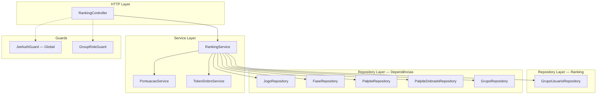
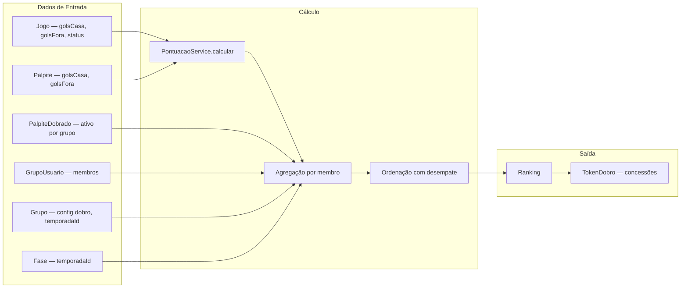

# Documento de Design — Módulo de Ranking

## Visão Geral

O módulo de Ranking calcula pontuações e classificações de membros dentro de grupos de bolão. A pontuação é derivada da comparação entre palpites e resultados reais de jogos finalizados, considerando apenas o placar do tempo normal (golsCasa/golsFora), ignorando prorrogação e pênaltis.

O módulo é dividido em dois services especializados seguindo o princípio de Single Responsibility:

1. **PontuacaoService**: Lógica pura de cálculo de pontos de um palpite individual. Função determinística sem dependências externas — recebe placar do palpite e placar do jogo, retorna categoria de acerto e pontos base.
2. **RankingService**: Orquestração de ranking — agrega pontuações, aplica multiplicador de PalpiteDobrado, monta rankings por fase e geral, gerencia concessão de TokenDobro por conquistas.

### Decisões de Design

- **PontuacaoService como função pura**: O cálculo de pontuação é uma operação determinística sem side effects. Isolar em um service dedicado facilita testes de propriedade e reutilização.
- **Cálculo on-the-fly vs tabela PontuacaoJogo**: Optamos por **não criar tabela** de pontuação persistida. O cálculo é feito sob demanda a partir dos dados existentes (Palpite, Jogo, PalpiteDobrado). Razões: (a) evita inconsistência entre dados calculados e dados fonte; (b) o volume de dados por grupo/fase é pequeno (dezenas de membros × dezenas de jogos); (c) simplifica o modelo de dados. Se performance se tornar problema no futuro, podemos adicionar cache ou materialização.
- **Multiplicador por contexto de grupo**: O PalpiteDobrado é por (usuarioId, jogoId, grupoId). O multiplicador 2x só se aplica no grupo onde foi ativado. O mesmo palpite pode ter multiplicador 1x em um grupo e 2x em outro.
- **Processamento de TokenDobro via chamada explícita**: Quando um jogo é finalizado, o caller (JogoService ou um endpoint de processamento) invoca `RankingService.processarPontuacaoJogo()`. Não usamos eventos assíncronos para manter simplicidade e rastreabilidade.
- **Desempate determinístico**: Pontuação total → acertos em cheio → acertos de resultado → ordem alfabética. Garante ordenação estável e previsível.
- **PST → AGENDADO**: Jogos adiados (PST na API-Football) devem mapear para AGENDADO em vez de CANCELADO, preservando palpites e PalpiteDobrado existentes. Requer alteração no `mapearStatusApiFootball` do JogoService.

## Arquitetura



### Fluxo de Dados

1. **Ranking por Fase**: `RankingController` → `RankingService.obterRankingFase(grupoId, faseId)` → busca membros do grupo, jogos finalizados da fase, palpites dos membros, PalpiteDobrados → `PontuacaoService.calcular()` para cada par (palpite, jogo) → agrega por membro → ordena com desempate → retorna ranking
2. **Ranking Geral**: `RankingController` → `RankingService.obterRankingGeral(grupoId)` → busca todas as fases da temporada do grupo → mesmo fluxo do ranking por fase, mas acumulando todas as fases
3. **Detalhamento por Jogo**: `RankingController` → `RankingService.obterDetalhamentoJogo(grupoId, jogoId)` → busca membros, palpites do jogo, PalpiteDobrados → calcula pontuação individual → retorna lista detalhada
4. **Processamento ao Finalizar Jogo**: `RankingService.processarPontuacaoJogo(jogoId)` → busca todos os grupos que possuem a temporada do jogo → para cada grupo: calcula pontuações, concede TokenDobro por acerto em cheio, verifica se fase encerrou → concede TokenDobro por posição no ranking

## Componentes e Interfaces

### RankingController

```typescript
@ApiTags(RANKING.TAG)
@Controller('grupos')
export class RankingController {
  // GET /grupos/:grupoId/ranking/geral — Ranking geral da temporada
  // Guards: GroupRoleGuard (ADMIN | MEMBER)
  obterRankingGeral(grupoId: string): Promise<RankingPresenter[]>

  // GET /grupos/:grupoId/ranking/fases/:faseId — Ranking por fase
  // Guards: GroupRoleGuard (ADMIN | MEMBER)
  obterRankingFase(grupoId: string, faseId: string): Promise<RankingPresenter[]>

  // GET /grupos/:grupoId/ranking/jogos/:jogoId — Detalhamento de pontuação por jogo
  // Guards: GroupRoleGuard (ADMIN | MEMBER)
  obterDetalhamentoJogo(grupoId: string, jogoId: string): Promise<PontuacaoJogoPresenter[]>

  // POST /grupos/:grupoId/ranking/processar-jogo/:jogoId — Processar pontuação de um jogo (ADMIN)
  // Guards: GroupRoleGuard (ADMIN)
  processarPontuacaoJogo(grupoId: string, jogoId: string): Promise<{ mensagem: string }>
}
```

### PontuacaoService

Service puro sem dependências de repositório. Contém a lógica de classificação de palpites.

```typescript
@Injectable()
export class PontuacaoService {
  // Calcula a pontuação de um palpite comparado ao resultado real do jogo.
  // Considera apenas tempo normal (golsCasa/golsFora do jogo).
  calcular(palpite: { golsCasa: number; golsFora: number } | null, jogo: { golsCasa: number; golsFora: number }): {
    categoriaAcerto: 'ACERTO_EM_CHEIO' | 'ACERTO_DE_RESULTADO' | 'ACERTO_DE_GOLS_UM_TIME' | 'ERRO_TOTAL' | null;
    pontosBase: number | null;
  }
}
```

**Pseudocódigo do cálculo:**

```
calcular(palpite, jogo):
  SE palpite é null:
    RETORNAR { categoriaAcerto: null, pontosBase: 0 }

  SE palpite.golsCasa == jogo.golsCasa E palpite.golsFora == jogo.golsFora:
    RETORNAR { categoriaAcerto: 'ACERTO_EM_CHEIO', pontosBase: 10 }

  resultadoPalpite = sinal(palpite.golsCasa - palpite.golsFora)
  resultadoJogo = sinal(jogo.golsCasa - jogo.golsFora)

  SE resultadoPalpite == resultadoJogo:
    RETORNAR { categoriaAcerto: 'ACERTO_DE_RESULTADO', pontosBase: 5 }

  SE palpite.golsCasa == jogo.golsCasa OU palpite.golsFora == jogo.golsFora:
    RETORNAR { categoriaAcerto: 'ACERTO_DE_GOLS_UM_TIME', pontosBase: 3 }

  RETORNAR { categoriaAcerto: 'ERRO_TOTAL', pontosBase: 0 }
```

**Nota sobre exclusividade mútua**: As categorias são avaliadas em ordem de prioridade. Acerto_Em_Cheio implica Acerto_De_Resultado e possivelmente Acerto_De_Gols_Um_Time, mas o palpite recebe apenas a pontuação da categoria mais alta. Acerto_De_Gols_Um_Time só se aplica quando o resultado (vitória/empate/derrota) está errado.

### RankingService

```typescript
@Injectable()
export class RankingService {
  constructor(
    pontuacaoService: PontuacaoService,
    tokenDobroService: TokenDobroService,
    jogoRepo: JogoRepository,
    faseRepo: FaseRepository,
    palpiteRepo: PalpiteRepository,
    palpiteDobradoRepo: PalpiteDobradoRepository,
    grupoUsuarioRepo: GrupoUsuarioRepository,
    grupoRepo: GrupoRepository,
  ) {}

  // Retorna ranking de uma fase específica para um grupo
  async obterRankingFase(grupoId: string, faseId: string): Promise<RankingEntry[]>

  // Retorna ranking geral (todas as fases da temporada) para um grupo
  async obterRankingGeral(grupoId: string): Promise<RankingEntry[]>

  // Retorna detalhamento de pontuação de um jogo para todos os membros do grupo
  async obterDetalhamentoJogo(grupoId: string, jogoId: string): Promise<PontuacaoJogoEntry[]>

  // Processa pontuação de um jogo finalizado para todos os grupos relevantes
  // Concede TokenDobro por acerto em cheio e por posição no ranking da fase (se encerrada)
  async processarPontuacaoJogo(jogoId: string): Promise<void>

  // Verifica e concede TokenDobro por palpites completos na fase
  async verificarPalpitesCompletos(faseId: string, grupoId: string): Promise<void>
}
```

**Tipos internos:**

```typescript
interface RankingEntry {
  posicao: number;
  usuarioId: string;
  nomeUsuario: string;
  pontuacaoTotal: number;
  acertosEmCheio: number;
  acertosDeResultado: number;
  acertosDeGolsUmTime: number;
  errosTotais: number;
}

interface PontuacaoJogoEntry {
  usuarioId: string;
  nomeUsuario: string;
  golsCasaPalpite: number | null;
  golsForaPalpite: number | null;
  categoriaAcerto: 'ACERTO_EM_CHEIO' | 'ACERTO_DE_RESULTADO' | 'ACERTO_DE_GOLS_UM_TIME' | 'ERRO_TOTAL' | null;
  pontosBase: number | null;
  multiplicador: number;
  pontosFinais: number | null;
  dobrado: boolean;
}
```

### Lógica de Ranking (Pseudocódigo)

```
obterRankingFase(grupoId, faseId):
  grupo = grupoRepo.buscarPorId(grupoId)
  SE !grupo: lançar GrupoNaoEncontradoError

  fase = faseRepo.buscarPorId(faseId)
  SE !fase: lançar FaseNaoEncontradaError

  membros = grupoUsuarioRepo.listarPorGrupo(grupoId)  // com include usuario.nome
  jogosFinalizados = jogoRepo.buscarPorFase(faseId).filter(j => j.status == 'FINALIZADO')

  PARA CADA membro:
    palpites = buscar palpites do membro para os jogos finalizados (batch query)
    dobrados = buscar PalpiteDobrados do membro para os jogos no grupo (batch query)

    pontuacaoTotal = 0
    contadores = { cheio: 0, resultado: 0, golsUmTime: 0, erros: 0 }

    PARA CADA jogo em jogosFinalizados:
      palpite = palpites[jogo.id] ou null
      { categoriaAcerto, pontosBase } = pontuacaoService.calcular(palpite, jogo)

      multiplicador = 1
      SE grupo.palpiteDobradoHabilitado E dobrados[jogo.id] existe:
        multiplicador = 2

      pontosFinais = (pontosBase ?? 0) * multiplicador
      pontuacaoTotal += pontosFinais

      incrementar contador da categoriaAcerto

  ordenar membros por:
    1. pontuacaoTotal DESC
    2. acertosEmCheio DESC
    3. acertosDeResultado DESC
    4. nomeUsuario ASC (alfabético)

  atribuir posições (membros empatados em todos os critérios numéricos recebem mesma posição)

  RETORNAR ranking
```

### DTOs

Não há DTOs de entrada para o módulo de Ranking — todos os endpoints são GET (consulta) exceto o processamento que recebe apenas params de URL.

### Domain Errors

```typescript
// src/common/errors/domain-errors/ranking.errors.ts

export class FaseNaoEncontradaNoRankingError extends DomainError {
  readonly statusCode = 404;
  constructor(mensagem = RANKING.MENSAGENS.FASE_NAO_ENCONTRADA) {
    super(mensagem);
  }
}

export class JogoNaoFinalizadoError extends DomainError {
  readonly statusCode = 400;
  constructor(mensagem = RANKING.MENSAGENS.JOGO_NAO_FINALIZADO) {
    super(mensagem);
  }
}
```

**Erros reutilizados de outros módulos:**

| Erro | Módulo Origem | Quando |
|------|---------------|--------|
| `GrupoNaoEncontradoError` | Grupos | Grupo não existe |
| `JogoNaoEncontradoError` | Jogos | Jogo não existe |
| `FaseNaoEncontradaError` | Jogos | Fase não existe |
| `ErrorFactory.forbidden()` | Common | Usuário não é membro do grupo (via GroupRoleGuard) |

### Presenters

```typescript
// src/common/presenters/ranking.presenter.ts
export class RankingPresenter {
  static toHttp(entry: any) {
    return {
      posicao: entry.posicao,
      usuarioId: entry.usuarioId,
      nomeUsuario: entry.nomeUsuario,
      pontuacaoTotal: entry.pontuacaoTotal,
      acertosEmCheio: entry.acertosEmCheio,
      acertosDeResultado: entry.acertosDeResultado,
      acertosDeGolsUmTime: entry.acertosDeGolsUmTime,
      errosTotais: entry.errosTotais,
    };
  }
}

// src/common/presenters/pontuacao-jogo.presenter.ts
export class PontuacaoJogoPresenter {
  static toHttp(entry: any) {
    return {
      usuarioId: entry.usuarioId,
      nomeUsuario: entry.nomeUsuario,
      golsCasaPalpite: entry.golsCasaPalpite,
      golsForaPalpite: entry.golsForaPalpite,
      categoriaAcerto: entry.categoriaAcerto,
      pontosBase: entry.pontosBase,
      multiplicador: entry.multiplicador,
      pontosFinais: entry.pontosFinais,
      dobrado: entry.dobrado,
    };
  }
}
```

### Constants

```typescript
// src/modules/ranking/ranking.constants.ts
export const RANKING = {
  TAG: 'Ranking',
  MENSAGENS: {
    FASE_NAO_ENCONTRADA: 'Fase não encontrada',
    JOGO_NAO_ENCONTRADO: 'Jogo não encontrado',
    JOGO_NAO_FINALIZADO: 'O jogo ainda não foi finalizado',
    GRUPO_NAO_ENCONTRADO: 'Grupo não encontrado',
    PONTUACAO_PROCESSADA: 'Pontuação processada com sucesso',
  },
  PONTOS: {
    ACERTO_EM_CHEIO: 10,
    ACERTO_DE_RESULTADO: 5,
    ACERTO_DE_GOLS_UM_TIME: 3,
    ERRO_TOTAL: 0,
  },
  MULTIPLICADOR_DOBRO: 2,
} as const;
```

### Alteração no JogoService (Módulo Jogos)

O método `mapearStatusApiFootball` deve ser alterado para mapear `PST` (Postponed) para `AGENDADO` em vez de `CANCELADO`:

```typescript
// ANTES:
case 'CANC':
case 'PST':
  return 'CANCELADO';

// DEPOIS:
case 'CANC':
  return 'CANCELADO';
case 'PST':
  return 'AGENDADO';
```

Isso garante que jogos adiados permaneçam elegíveis para palpites e ranking.

## Modelos de Dados

### Alterações no Schema Prisma

**Nenhuma alteração necessária.** O módulo de Ranking opera inteiramente sobre dados existentes:

- `Jogo` (status, golsCasa, golsFora) — resultado real
- `Palpite` (golsCasa, golsFora, usuarioId, jogoId) — palpite do membro
- `PalpiteDobrado` (usuarioId, jogoId, grupoId) — multiplicador ativo
- `GrupoUsuario` (usuarioId, grupoId, role) — membros do grupo
- `Grupo` (temporadaId, palpiteDobradoHabilitado) — configuração do grupo
- `Fase` (temporadaId) — fases da temporada
- `TokenDobro` (usuarioId, grupoId, tipo, motivo, referenciaId) — concessão de fichas

O cálculo de pontuação é feito on-the-fly sem tabela intermediária.

### Queries Necessárias (extensões de repositórios existentes)

#### PalpiteRepository — novo método

```typescript
// Busca palpites de múltiplos usuários para múltiplos jogos (batch)
listarPorJogosEUsuarios(jogoIds: string[], usuarioIds: string[]): Promise<any[]>;
```

#### PalpiteDobradoRepository — novo método

```typescript
// Busca PalpiteDobrados de múltiplos jogos em um grupo (batch)
listarPorJogosEGrupo(jogoIds: string[], grupoId: string): Promise<any[]>;
```

#### GrupoUsuarioRepository — novo método

```typescript
// Lista membros do grupo com dados do usuário (nome)
listarPorGrupoComUsuario(grupoId: string): Promise<any[]>;
```

#### GrupoRepository — novo método

```typescript
// Busca todos os grupos de uma temporada
buscarPorTemporadaId(temporadaId: string): Promise<any[]>;
```

#### TokenDobroRepository — novo método

```typescript
// Verifica se já existe token com motivo e referenciaId específicos (idempotência)
buscarPorChave(usuarioId: string, grupoId: string, motivo: string, referenciaId: string): Promise<any>;
```

### Diagrama de Dependências de Dados



## Propriedades de Corretude

*Uma propriedade é uma característica ou comportamento que deve ser verdadeiro em todas as execuções válidas de um sistema — essencialmente, uma declaração formal sobre o que o sistema deve fazer. Propriedades servem como ponte entre especificações legíveis por humanos e garantias de corretude verificáveis por máquina.*

### Propriedade 1: Classificação de pontuação é mutuamente exclusiva e correta

*Para quaisquer* valores válidos de golsCasa e golsFora (inteiros ≥ 0) tanto do palpite quanto do jogo, `PontuacaoService.calcular()` deve retornar exatamente uma das quatro categorias com os pontos correspondentes:
- Se golsCasa do palpite == golsCasa do jogo E golsFora do palpite == golsFora do jogo → ACERTO_EM_CHEIO (10 pontos)
- Senão, se o resultado (vitória casa / vitória fora / empate) coincide → ACERTO_DE_RESULTADO (5 pontos)
- Senão, se pelo menos um dos times tem gols iguais → ACERTO_DE_GOLS_UM_TIME (3 pontos)
- Senão → ERRO_TOTAL (0 pontos)

**Valida: Requisitos 1.1, 1.2, 1.3, 1.4, 1.5, 1.6**

### Propriedade 2: Pontuação ignora prorrogação e pênaltis

*Para qualquer* jogo finalizado com dados de prorrogação e/ou pênaltis, e qualquer palpite, o resultado de `PontuacaoService.calcular()` deve ser idêntico ao resultado calculado usando apenas golsCasa e golsFora do tempo normal, ignorando golsProrrogacaoCasa, golsProrrogacaoFora, penaltisCasa e penaltisFora.

**Valida: Requisito 1.7**

### Propriedade 3: Palpite null resulta em 0 pontos com categoria null

*Para qualquer* jogo finalizado com placar válido, `PontuacaoService.calcular(null, jogo)` deve retornar `{ categoriaAcerto: null, pontosBase: 0 }`, diferenciando de ERRO_TOTAL que retorna `{ categoriaAcerto: 'ERRO_TOTAL', pontosBase: 0 }`.

**Valida: Requisitos 13.1, 13.3**

### Propriedade 4: Multiplicador de dobro aplicado corretamente por contexto de grupo

*Para qualquer* palpite em qualquer grupo, o multiplicador aplicado deve ser:
- 2 se o grupo possui `palpiteDobradoHabilitado = true` E existe PalpiteDobrado ativo para (usuarioId, jogoId, grupoId)
- 1 em todos os outros casos (grupo sem dobro habilitado, ou sem PalpiteDobrado ativo, ou ambos)

O multiplicador deve ser aplicado apenas no contexto do grupo onde o PalpiteDobrado foi ativado — o mesmo palpite em outro grupo deve usar multiplicador independente.

**Valida: Requisitos 2.1, 2.2, 2.3, 2.4**

### Propriedade 5: Ranking ordenado por pontuação decrescente com desempate determinístico

*Para qualquer* conjunto de membros de um grupo com pontuações calculadas, o ranking (tanto por fase quanto geral) deve estar ordenado por:
1. pontuacaoTotal DESC
2. acertosEmCheio DESC (primeiro desempate)
3. acertosDeResultado DESC (segundo desempate)
4. nomeUsuario ASC (ordem alfabética, desempate final)

Membros empatados em todos os critérios numéricos (pontuacaoTotal, acertosEmCheio, acertosDeResultado) devem receber a mesma posição.

**Valida: Requisitos 3.1, 3.2, 4.1, 4.2, 12.1, 12.2, 12.3, 12.4**

### Propriedade 6: Membros sem palpites aparecem no ranking com pontuação zero

*Para qualquer* grupo e fase, todos os membros do grupo (GrupoUsuario) devem aparecer no ranking, mesmo aqueles sem nenhum palpite registrado para jogos finalizados da fase. Esses membros devem ter pontuacaoTotal = 0 e todos os contadores de acerto = 0.

**Valida: Requisitos 3.3, 3.6**

### Propriedade 7: Apenas jogos FINALIZADO contribuem para o ranking

*Para qualquer* fase contendo jogos com status variados (AGENDADO, EM_ANDAMENTO, FINALIZADO, CANCELADO), apenas jogos com status FINALIZADO devem contribuir para o cálculo de pontuação e ranking. Jogos com outros status devem ser ignorados no cálculo.

**Valida: Requisitos 14.1, 14.3**

### Propriedade 8: Detalhamento de jogo não-finalizado retorna pontuação null

*Para qualquer* jogo com status diferente de FINALIZADO, o detalhamento de pontuação deve retornar pontosBase e pontosFinais como null para todos os membros, enquanto os dados do palpite (golsCasaPalpite, golsForaPalpite) devem ser preenchidos quando o palpite existe.

**Valida: Requisito 5.2**

### Propriedade 9: Flag dobrado reflete corretamente a existência de PalpiteDobrado

*Para qualquer* membro e jogo no detalhamento de pontuação, a flag `dobrado` deve ser `true` se e somente se existe um registro PalpiteDobrado para (usuarioId, jogoId, grupoId).

**Valida: Requisito 5.4**

### Propriedade 10: TokenDobro por acerto em cheio concedido corretamente

*Para qualquer* jogo finalizado em um grupo com `palpiteDobradoHabilitado = true`, o sistema deve conceder exatamente 1 TokenDobro com motivo ACERTO_EM_CHEIO e referenciaId = jogoId para cada membro cujo palpite é um Acerto_Em_Cheio. Nenhum token deve ser concedido se o grupo tem `palpiteDobradoHabilitado = false`.

**Valida: Requisitos 6.1, 6.2**

### Propriedade 11: TokenDobro por posição no ranking da fase concedido corretamente

*Para qualquer* fase encerrada (todos os jogos FINALIZADO ou CANCELADO, com pelo menos 1 FINALIZADO) em um grupo com `palpiteDobradoHabilitado = true`, o sistema deve conceder 1 TokenDobro com motivo PRIMEIRO_RANKING ao(s) membro(s) na primeira posição e 1 TokenDobro com motivo ULTIMO_RANKING ao(s) membro(s) na última posição, usando faseId como referenciaId. Em caso de empate na posição, todos os empatados recebem o token. Nenhum token deve ser concedido se o grupo tem `palpiteDobradoHabilitado = false` ou se a fase possui apenas jogos cancelados.

**Valida: Requisitos 7.1, 7.2, 7.3, 7.4, 7.5, 7.7**

### Propriedade 12: TokenDobro por palpites completos na fase

*Para qualquer* membro de um grupo com `palpiteDobradoHabilitado = true` que possui palpites registrados para todos os jogos não-cancelados de uma fase, com dataCriacao do palpite anterior ao dataHora do primeiro jogo da fase, o sistema deve conceder 1 TokenDobro com motivo PALPITES_COMPLETOS e referenciaId = faseId. Jogos cancelados são excluídos da verificação de completude. Nenhum token se o grupo tem dobro desabilitado.

**Valida: Requisitos 8.1, 8.2, 8.4**

### Propriedade 13: Idempotência do processamento de pontuação e concessão de tokens

*Para qualquer* jogo finalizado, processar a pontuação duas vezes consecutivas deve produzir o mesmo ranking e não duplicar registros de TokenDobro. A segunda execução deve detectar tokens já concedidos (por motivo + referenciaId + usuarioId + grupoId) e não criar duplicatas.

**Valida: Requisitos 6.3, 7.6, 8.3, 9.5**

### Propriedade 14: Processamento multi-grupo ao finalizar jogo

*Para qualquer* jogo finalizado pertencente a uma temporada com múltiplos grupos, o processamento deve calcular pontuação para todos os grupos que possuem aquela temporada. Falha no processamento de um grupo não deve impedir o processamento dos demais.

**Valida: Requisitos 9.1, 9.4**

### Propriedade 15: RankingPresenter retorna apenas campos da allowlist

*Para qualquer* objeto de ranking (incluindo campos extras não previstos), `RankingPresenter.toHttp()` deve retornar um objeto contendo exatamente os campos: posicao, usuarioId, nomeUsuario, pontuacaoTotal, acertosEmCheio, acertosDeResultado, acertosDeGolsUmTime, errosTotais — e nenhum campo adicional.

**Valida: Requisitos 11.1, 11.2**

### Propriedade 16: PontuacaoJogoPresenter retorna apenas campos da allowlist

*Para qualquer* objeto de detalhamento de pontuação (incluindo campos extras não previstos), `PontuacaoJogoPresenter.toHttp()` deve retornar um objeto contendo exatamente os campos: usuarioId, nomeUsuario, golsCasaPalpite, golsForaPalpite, categoriaAcerto, pontosBase, multiplicador, pontosFinais, dobrado — e nenhum campo adicional.

**Valida: Requisito 11.3**

## Tratamento de Erros

### Domain Errors do Módulo

| Erro | Status HTTP | Quando |
|------|-------------|--------|
| `JogoNaoFinalizadoError` | 400 | Tentativa de processar pontuação de jogo não finalizado |

### Erros Reutilizados de Outros Módulos

| Erro | Módulo Origem | Quando |
|------|---------------|--------|
| `GrupoNaoEncontradoError` | Grupos | Grupo não existe |
| `JogoNaoEncontradoError` | Jogos | Jogo não existe |
| `FaseNaoEncontradaError` | Jogos | Fase não existe |
| `ErrorFactory.forbidden()` | Common | Usuário não é membro do grupo (via GroupRoleGuard) |

### Resiliência no Processamento

- **Erro em um grupo não propaga**: Ao processar pontuação de um jogo para múltiplos grupos, se um grupo falha, o erro é logado via `Logger.error()` e o processamento continua para os demais grupos.
- **Idempotência de tokens**: Antes de conceder um TokenDobro, o sistema verifica se já existe um registro com o mesmo (usuarioId, grupoId, motivo, referenciaId). Se existir, não cria duplicata.
- **Jogo não finalizado**: Se `processarPontuacaoJogo` é chamado para um jogo que não está FINALIZADO, lança `JogoNaoFinalizadoError`.

## Estratégia de Testes

### Abordagem Dual: Testes Unitários + Testes de Propriedade

O módulo utiliza duas abordagens complementares:

1. **Testes unitários (Vitest)**: Exemplos específicos, edge cases, condições de erro, integração entre componentes
2. **Testes de propriedade (fast-check via Vitest)**: Propriedades universais com inputs gerados aleatoriamente

### Biblioteca de Property-Based Testing

- **Biblioteca**: `fast-check` (compatível com Vitest, já utilizado no projeto)
- **Configuração**: Mínimo de 100 iterações por teste de propriedade
- **Tag**: Cada teste de propriedade deve incluir comentário referenciando a propriedade do design
- **Formato**: `// Feature: modulo-ranking, Property {N}: {título}`

### Testes de Propriedade (cada propriedade = 1 teste PBT)

Cada uma das 16 propriedades listadas na seção de Corretude deve ser implementada como um único teste baseado em propriedades usando fast-check. Os testes usam InMemory repositories para isolamento.

**Generators necessários:**

- `arbGols()` — `fc.nat({ max: 15 })` para gols (inteiros ≥ 0, max razoável)
- `arbPalpite()` — `fc.record({ golsCasa: arbGols(), golsFora: arbGols() })`
- `arbPalpiteOuNull()` — `fc.option(arbPalpite(), { nil: null })`
- `arbJogoFinalizado()` — gera jogo com status FINALIZADO e golsCasa/golsFora preenchidos
- `arbJogoComStatus(status)` — gera jogo com status específico
- `arbMembro()` — gera membro com usuarioId, nome aleatório
- `arbMembros(n)` — gera lista de n membros distintos
- `arbRankingEntry()` — gera entrada de ranking com todos os campos
- `arbPontuacaoJogoEntry()` — gera entrada de detalhamento com todos os campos
- `arbCategoriaAcerto()` — `fc.constantFrom('ACERTO_EM_CHEIO', 'ACERTO_DE_RESULTADO', 'ACERTO_DE_GOLS_UM_TIME', 'ERRO_TOTAL')`

### Testes Unitários

Seguem o padrão existente do projeto:
- Services testados com InMemory repositories: `new PontuacaoService()`, `new RankingService(pontuacaoService, tokenDobroService, ...inMemoryRepos)`
- Controllers testados com `new RankingController(mockService as any)`
- Instanciação direta com mocks (`vi.fn()`) — **NUNCA** usar `TestingModule`
- Imports explícitos: `import { describe, it, expect, beforeEach, vi } from 'vitest'`

#### Cobertura de Testes Unitários

**PontuacaoService:**
- Acerto em cheio: 2x1 palpite == 2x1 jogo → 10 pontos
- Acerto de resultado: 3x1 palpite, 2x0 jogo (vitória casa) → 5 pontos
- Acerto de gols um time: 2x1 palpite, 2x3 jogo (acertou golsCasa mas resultado errado) → 3 pontos
- Erro total: 1x0 palpite, 0x2 jogo → 0 pontos
- Palpite null → 0 pontos, categoria null
- Empate correto: 1x1 palpite, 0x0 jogo → 5 pontos (resultado correto, placar diferente)

**RankingService:**
- Ranking por fase com jogos finalizados (happy path)
- Ranking por fase sem jogos finalizados → todos com 0 pontos
- Ranking geral acumulando múltiplas fases
- Detalhamento de jogo finalizado com palpites variados
- Detalhamento de jogo não finalizado → pontuação null
- Processamento de pontuação com concessão de tokens
- Fase encerrada → tokens de posição concedidos
- Fase não encerrada → sem tokens de posição
- Erro em um grupo não propaga para outros
- Idempotência: processar duas vezes não duplica tokens
- Grupo inexistente → GrupoNaoEncontradoError
- Fase inexistente → FaseNaoEncontradaError
- Jogo inexistente → JogoNaoEncontradoError
- Palpites completos → token PALPITES_COMPLETOS
- Fase com apenas jogos cancelados → sem tokens de posição

**RankingController:**
- Rotas delegam corretamente para RankingService
- Presenters aplicados nas respostas
- Guards configurados (GroupRoleGuard com ADMIN | MEMBER)

**Presenters:**
- RankingPresenter.toHttp — campos corretos, sem campos extras
- PontuacaoJogoPresenter.toHttp — campos corretos, sem campos extras

### Estrutura de Arquivos de Teste

```
src/modules/ranking/
├── pontuacao.service.spec.ts          # Unit tests PontuacaoService
├── pontuacao.service.pbt.spec.ts      # Property tests PontuacaoService
├── ranking.service.spec.ts            # Unit tests RankingService
├── ranking.service.pbt.spec.ts        # Property tests RankingService
├── ranking.controller.spec.ts         # Unit tests RankingController
```

```
src/common/presenters/
├── ranking.presenter.spec.ts          # Unit + Property tests RankingPresenter
├── pontuacao-jogo.presenter.spec.ts   # Unit + Property tests PontuacaoJogoPresenter
```
