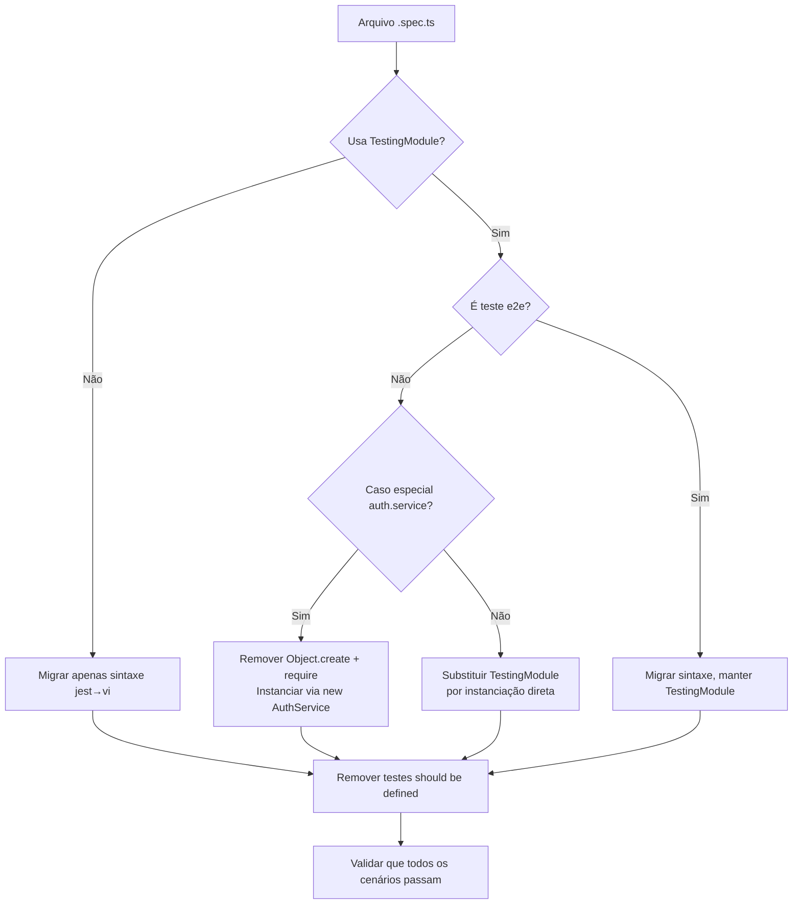

# Design Técnico — Padronizar Testes (Jest → Vitest)

## Visão Geral

Este design descreve a migração completa do framework de testes do projeto de Jest para Vitest 4, incluindo a substituição do padrão de instanciação via `TestingModule` do NestJS por instanciação direta com mocks manuais (`vi.fn()`).

A migração abrange 13 arquivos de teste (`.spec.ts`), 1 arquivo de mock compartilhado (`test/mocks/prisma.mock.ts`), configuração do Vitest, atualização de scripts no `package.json` e remoção de artefatos do Jest.

### Escopo dos Arquivos

| Categoria | Arquivos | Padrão Atual |
|-----------|----------|--------------|
| Services com TestingModule | `campeonatos.service.spec.ts`, `temporadas.service.spec.ts`, `usuarios.service.spec.ts`, `grupos.service.spec.ts`, `grupo-usuario.service.spec.ts` | `Test.createTestingModule()` + `module.get()` + `jest.fn()` |
| Controllers com TestingModule | `campeonatos.controller.spec.ts`, `temporadas.controller.spec.ts`, `grupos.controller.spec.ts`, `app.controller.spec.ts` | `Test.createTestingModule()` + `module.get()` — apenas teste `should be defined` |
| Guards com TestingModule | `group-role.guard.spec.ts` | `Test.createTestingModule()` + `module.get()` + `jest.fn()` |
| Já com instanciação direta | `auth.controller.spec.ts`, `self-or-admin.guard.spec.ts`, `parse-uuid-custom.pipe.spec.ts`, `error.factory.spec.ts` | `new Class()` + `jest.fn()` |
| Caso especial | `auth.service.spec.ts` | `Object.create(prototype)` + `require()` dinâmico + `jest.mock()` |
| Filter | `prisma-exception.filter.spec.ts` | `new Class()` + `jest.fn()` |
| Mock compartilhado | `test/mocks/prisma.mock.ts` | `jest.fn()` |
| E2E | `test/app.e2e-spec.ts` | `Test.createTestingModule()` com `AppModule` real |

### Decisões de Design

1. **Vitest 4 com globals desabilitados**: imports explícitos de `describe`, `it`, `expect`, `beforeEach`, `vi` do `vitest` para clareza e compatibilidade com linting. O Vitest injeta globais por padrão, mas imports explícitos são aceitos conforme o requisito 3.7.

2. **`vitest.config.ts` separado**: não embutir configuração no `package.json` — arquivo dedicado na raiz do projeto para manter separação de responsabilidades.

3. **Instanciação direta para todos**: services recebem mock do Prisma via construtor (`new ServiceClass(mockPrisma as any)`), controllers recebem mock do service (`new ControllerClass(mockService as any)`), guards recebem mocks das dependências.

4. **Remoção de testes `should be defined`**: testes que apenas validam `expect(x).toBeDefined()` são redundantes com instanciação direta — se o construtor falhar, todos os testes falham.

5. **E2E mantido com TestingModule**: o arquivo `test/app.e2e-spec.ts` usa `TestingModule` com `AppModule` real para teste de integração. Este arquivo será migrado apenas na sintaxe (jest → vi), mantendo o padrão `TestingModule` por ser um teste e2e legítimo.

## Arquitetura

### Estrutura de Configuração

```
raiz/
├── vitest.config.ts          # Nova configuração do Vitest
├── package.json              # Scripts atualizados, Jest removido
├── tsconfig.json             # Sem alterações (path aliases já definidos)
├── src/
│   ├── **/*.spec.ts          # Testes migrados (vi.fn, instanciação direta)
│   └── ...
├── test/
│   ├── mocks/
│   │   └── prisma.mock.ts    # Migrado para vi.fn()
│   └── app.e2e-spec.ts       # Migrado sintaxe, mantém TestingModule
└── (removidos)
    ├── jest.config.* (se existir)
    └── test/jest-e2e.json
```

### Fluxo de Migração por Arquivo



## Componentes e Interfaces

### 1. Configuração Vitest (`vitest.config.ts`)

```typescript
import { defineConfig } from 'vitest/config';
import path from 'path';

export default defineConfig({
  test: {
    environment: 'node',
    root: 'src',
    include: ['**/*.spec.ts'],
    alias: {
      src: path.resolve(__dirname, 'src'),
    },
    coverage: {
      provider: 'v8',
      reportsDirectory: '../coverage',
    },
  },
});
```

**Decisões**:
- `root: 'src'` — alinhado com a configuração atual do Jest (`rootDir: "src"`)
- `alias` resolve `src/*` para caminhos absolutos, compatível com `moduleNameMapper` do Jest
- `coverage.provider: 'v8'` — provider nativo, sem dependência extra além de `@vitest/coverage-v8`
- `environment: 'node'` — adequado para backend NestJS
- Não é necessário `transformIgnorePatterns` para `nanoid` — Vitest usa ESBuild nativamente e suporta ESM sem configuração extra

### 2. Padrão de Mock — Antes e Depois

**Antes (Jest)**:
```typescript
import { Test, TestingModule } from '@nestjs/testing';
import { GruposService } from './grupos.service';
import { PrismaService } from '../../prisma/prisma.service';

const mockPrisma = {
  grupo: { create: jest.fn(), findMany: jest.fn() },
  $transaction: jest.fn((cb) => cb(mockTx)),
};

describe('GruposService', () => {
  let service: GruposService;

  beforeEach(async () => {
    const module: TestingModule = await Test.createTestingModule({
      providers: [
        GruposService,
        { provide: PrismaService, useValue: mockPrisma },
      ],
    }).compile();
    service = module.get<GruposService>(GruposService);
    jest.clearAllMocks();
  });
});
```

**Depois (Vitest)**:
```typescript
import { describe, it, expect, beforeEach, vi } from 'vitest';
import { GruposService } from './grupos.service';

const mockPrisma = {
  grupo: { create: vi.fn(), findMany: vi.fn() },
  $transaction: vi.fn((cb) => cb(mockTx)),
};

describe('GruposService', () => {
  let service: GruposService;

  beforeEach(() => {
    service = new GruposService(mockPrisma as any);
    vi.clearAllMocks();
  });
});
```

### 3. Migração do `auth.service.spec.ts` (Caso Especial)

**Antes**:
```typescript
jest.mock('bcryptjs');
jest.mock('../../common/errors/error.factory', () => ({
  ErrorFactory: { unauthorized: (msg) => new UnauthorizedException(...) }
}));

let AuthService: any;
let service: any;

beforeAll(() => {
  const mod = require('./auth.service');
  AuthService = mod.AuthService;
});

beforeEach(() => {
  service = Object.create(AuthService.prototype);
  service.prisma = mockPrisma;
  service.jwtService = mockJwt;
});
```

**Depois**:
```typescript
import { describe, it, expect, beforeEach, vi } from 'vitest';
import { AuthService } from './auth.service';

vi.mock('bcryptjs');

const mockPrisma = { ... };
const mockJwt = { ... };

describe('AuthService', () => {
  let service: AuthService;

  beforeEach(() => {
    service = new AuthService(mockPrisma as any, mockJwt as any);
    vi.clearAllMocks();
  });
});
```

**Mudanças chave**:
- Remover `jest.mock('../../common/errors/error.factory')` — usar implementação real do `ErrorFactory`, validando exceções pelo tipo correto (`UnauthorizedException`, `NotFoundException`)
- Remover `require()` dinâmico e `beforeAll` — usar import estático
- Remover `Object.create(prototype)` — usar `new AuthService(mockPrisma, mockJwt)`
- Substituir `(bcrypt.compare as jest.Mock)` por `(bcrypt.compare as any)` ou tipagem do Vitest

### 4. Migração do `group-role.guard.spec.ts`

**Antes**: usa `TestingModule` para injetar `Reflector` e `PrismaService`.

**Depois**: instanciação direta `new GroupRoleGuard(mockReflector as any, mockPrisma as any)`.

### 5. Controllers com Apenas `should be defined`

Os arquivos `campeonatos.controller.spec.ts`, `temporadas.controller.spec.ts` e `grupos.controller.spec.ts` atualmente só testam `should be defined` via `TestingModule`. Após migração:
- Substituir `TestingModule` por instanciação direta
- Remover teste `should be defined` (redundante)
- O arquivo ficará com um `describe` vazio ou com testes futuros — manter o arquivo para facilitar adição de testes no futuro

### 6. Mock Compartilhado (`test/mocks/prisma.mock.ts`)

Migrar `jest.fn()` → `vi.fn()` e adicionar import do `vi`:

```typescript
import { vi } from 'vitest';

export const prismaMock = {
  grupo: { create: vi.fn(), findMany: vi.fn(), ... },
  campeonato: { create: vi.fn(), findMany: vi.fn(), ... },
  temporada: { create: vi.fn(), findMany: vi.fn(), ... },
};
```

## Modelos de Dados

Não há alterações em modelos de dados. A migração é puramente de infraestrutura de testes.

### Mapeamento de APIs Jest → Vitest

| Jest | Vitest | Notas |
|------|--------|-------|
| `jest.fn()` | `vi.fn()` | Drop-in replacement |
| `jest.mock('module')` | `vi.mock('module')` | Hoisting automático no Vitest |
| `jest.spyOn(obj, 'method')` | `vi.spyOn(obj, 'method')` | Drop-in replacement |
| `jest.clearAllMocks()` | `vi.clearAllMocks()` | Drop-in replacement |
| `as jest.Mock` | `as any` | Ou usar `Mock` do Vitest |
| `jest.fn((cb) => cb(mock))` | `vi.fn((cb) => cb(mock))` | Para `$transaction` |
| `@nestjs/testing` imports | Removidos | Exceto em e2e |
| `Test.createTestingModule()` | `new Class(mock)` | Instanciação direta |
| `module.get<T>()` | Variável direta | Sem container DI |

### Dependências a Adicionar/Remover

| Ação | Pacote | Tipo |
|------|--------|------|
| Adicionar | `vitest` | devDependency |
| Adicionar | `@vitest/coverage-v8` | devDependency |
| Remover | `jest` | devDependency |
| Remover | `ts-jest` | devDependency |
| Remover | `@types/jest` | devDependency |
| Manter | `@nestjs/testing` | devDependency (usado em e2e) |


## Propriedades de Corretude

*Uma propriedade é uma característica ou comportamento que deve ser verdadeiro em todas as execuções válidas de um sistema — essencialmente, uma declaração formal sobre o que o sistema deve fazer. Propriedades servem como ponte entre especificações legíveis por humanos e garantias de corretude verificáveis por máquina.*

A análise do prework identificou que a maioria dos critérios de aceitação são verificações de configuração estática (exemplos) ou convenções não testáveis automaticamente. Após consolidação, três propriedades universais emergem:

### Propriedade 1: Ausência de APIs do Jest em arquivos de teste

*Para qualquer* arquivo `.spec.ts` no projeto, o conteúdo do arquivo não deve conter nenhuma referência a APIs do Jest: `jest.fn`, `jest.mock`, `jest.spyOn`, `jest.clearAllMocks`, ou type casts `as jest.Mock`.

**Valida: Requisitos 3.1, 3.2, 3.3, 3.4, 3.5, 3.6, 5.2, 7.5**

### Propriedade 2: Ausência de imports do `@nestjs/testing` em testes unitários

*Para qualquer* arquivo `.spec.ts` dentro do diretório `src/`, o conteúdo do arquivo não deve conter imports de `@nestjs/testing` (ou seja, `Test`, `TestingModule`). Nota: o arquivo `test/app.e2e-spec.ts` está excluído desta propriedade por ser um teste e2e.

**Valida: Requisitos 4.1, 4.2, 4.3, 4.4, 7.4**

### Propriedade 3: Ausência de testes redundantes `should be defined`

*Para qualquer* arquivo `.spec.ts` no projeto, o conteúdo do arquivo não deve conter blocos `it('should be defined')` que apenas validam `expect(x).toBeDefined()`.

**Valida: Requisito 6.4**

## Tratamento de Erros

### Erros de Migração

| Cenário | Causa | Resolução |
|---------|-------|-----------|
| `vi is not defined` | Import do `vi` ausente ou globals não configurado | Adicionar `import { vi } from 'vitest'` no arquivo |
| `Cannot find module 'nanoid'` | ESM não resolvido pelo Vitest | Vitest suporta ESM nativamente — verificar se `vitest.config.ts` está correto |
| `TypeError: X is not a constructor` | Mock incompleto passado ao construtor | Garantir que o mock tem todas as propriedades acessadas pelo service |
| Teste falha após remover mock do ErrorFactory | `auth.service.spec.ts` — asserções esperavam mock, agora recebem exceção real | Atualizar asserções para validar tipo da exceção (`toThrow(UnauthorizedException)`) |
| `$transaction` mock não funciona | Callback não executado | Garantir `vi.fn((cb) => cb(mockTx))` no mock do Prisma |

### Riscos

1. **Compatibilidade de hoisting**: `vi.mock()` tem hoisting automático como `jest.mock()`, mas o comportamento pode diferir em edge cases. Mitigação: testar cada arquivo individualmente após migração.

2. **Módulo `nanoid` (ESM)**: Jest precisava de `transformIgnorePatterns` para lidar com ESM. Vitest usa ESBuild e suporta ESM nativamente. Se houver problemas, configurar `deps.inline` no `vitest.config.ts`.

3. **Tipagem de mocks**: `as jest.Mock` será substituído por `as any`. Alternativa mais tipada: usar `Mock` do Vitest (`import { Mock } from 'vitest'`), mas `as any` é aceito pelo projeto (regra `@typescript-eslint/no-explicit-any: off`).

## Estratégia de Testes

### Abordagem Dual

A migração será validada com dois tipos de teste:

1. **Testes unitários (exemplos)**: verificações pontuais de configuração e arquivos específicos
2. **Testes de propriedade (property-based)**: verificações universais sobre todos os arquivos de teste

### Testes Unitários

Verificações pontuais para critérios de aceitação que são exemplos:

- `vitest.config.ts` contém `environment: 'node'`, `root: 'src'`, `include: ['**/*.spec.ts']`
- `package.json` scripts: `test` = `vitest run`, `test:watch` = `vitest`, `test:cov` = `vitest run --coverage`
- `package.json` devDependencies inclui `vitest` e `@vitest/coverage-v8`
- `package.json` não contém `jest`, `ts-jest`, `@types/jest` em devDependencies
- `package.json` não contém seção `jest`
- `test/jest-e2e.json` não existe
- `auth.service.spec.ts` não contém `Object.create`, `require(`, nem mock do `ErrorFactory`
- `vitest run` executa com zero falhas

### Testes de Propriedade

Biblioteca: **fast-check** (compatível com Vitest, madura, bem documentada para TypeScript).

Cada propriedade será implementada como um único teste que itera sobre a coleção de arquivos de teste do projeto:

- **Feature: padronizar-testes, Propriedade 1: Ausência de APIs do Jest** — Para cada arquivo `.spec.ts`, verificar ausência de padrões `jest.*`
- **Feature: padronizar-testes, Propriedade 2: Ausência de @nestjs/testing em unitários** — Para cada arquivo `.spec.ts` em `src/`, verificar ausência de imports `@nestjs/testing`
- **Feature: padronizar-testes, Propriedade 3: Ausência de should be defined** — Para cada arquivo `.spec.ts`, verificar ausência de `it('should be defined'`

**Nota**: Neste caso específico de migração, as propriedades são verificáveis por busca textual (grep) nos arquivos. Os testes de propriedade podem usar `fast-check` para gerar subconjuntos aleatórios dos arquivos e verificar a propriedade, ou simplesmente iterar sobre todos os arquivos. A abordagem pragmática é iterar sobre todos os arquivos, já que o conjunto é finito e pequeno (~13 arquivos).

### Configuração

- Mínimo 100 iterações por teste de propriedade
- Cada teste deve referenciar a propriedade do design com comentário: `// Feature: padronizar-testes, Property N: <descrição>`
